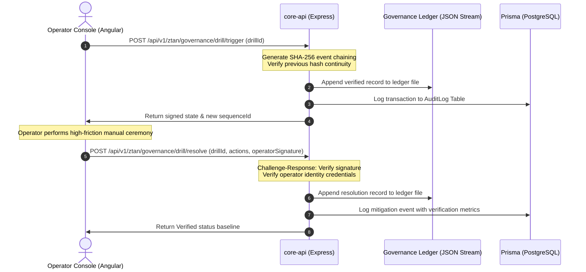

# Implementation Plan: Verifiable Backend Governance Ledger & Operator Security

This document details the architectural transition of the **Nexus ZTAN Operational Proving Ground** simulation into a stateful, cryptographically secured backend governance and stewardship engine. 

---

## 1. Architectural Blueprint & Data Flow

Currently, the `stewardship-console` runs state changes purely in memory within the browser via an Angular service. The core orchestrator (`apps/core-api`) is running but is disconnected from the console's state mutations.

To fulfill Phase 43/44 operational reliability standards, we will establish a cryptographically validated, stateful backend.

---

## 2. Implementation Deliverables

### Deliverable A: Cryptographically Secured Ledger Service (`packages/utils/src/governance-ledger.ts`)
- **Immutable SHA-256 Hash Chaining**: Implement a sequential ledger where each entry is chained to the previous entry's hash.
- **Verification Integrity Check**: Implement a function that verifies the entire ledger from genesis. If any historical log or active incident is mutated or tampered with, the cryptographic link breaks.
- **Durable File-Backed Persistence**: Store ledger entries in `.ztan-transparency/governance_ledger.json`, protected by file locking to prevent write collisions.

### Deliverable B: State & Drill Controller (`apps/core-api/src/routes/ztan-governance.ts`)
- **State Registry**: Expose standard CRUD routes and operational endpoints under `/api/v1/ztan/governance/*` for:
  - `GET /state` — Fetch current ZTAN operational state (active incidents, trust level, decision latency, habituation risk).
  - `POST /drill/trigger` — Ingest a stress transition (Replay Poisoning, Telemetry Erosion, Governance Collapse, etc.) and append to the ledger.
  - `POST /drill/resolve` — Validate high-friction credentials, record operator reaction times, and restore the baseline.
  - `POST /proposal/resolve` — Process individual capability expansion proposals.
  - `POST /aging` — Simulate long-horizon system decay.
  - `POST /reset` — Clear active incidents and restore absolute verified baseline.
- **Optimistic Concurrency & Lock Safeguards**: Enforce locks to prevent race conditions during multi-operator override ceremonies.

### Deliverable C: Angular Stewardship Sync (`stewardship.service.ts`)
- **HTTP Client Integration**: Refactor the frontend `StewardshipService` to query `/api/v1/ztan/governance` instead of modifying local properties.
- **Active Polling/Sync**: Synchronize telemetry metrics in real-time, pulling active drills, incident lists, and timeline evidence from the server.

---

## 3. Cryptographic Formulation

The ledger cryptographic chain is calculated recursively:

$$Hash_{n} = \text{SHA-256}(Hash_{n-1} + SequenceId_{n} + Timestamp_{n} + Type_{n} + Payload_{n} + OperatorId_{n} + Signature_{n})$$

Where:
- $Hash_{0} = \text{"0x0000000000000000000000000000000000000000000000000000000000000000"}$
- $Signature_{n} = \text{HMAC-SHA256}(Payload_{n}, \text{env.ZTAN\_KMS\_SALT})$

If $Hash_{n}$ does not match the computed hash of the current node, or if the preceding node's stored hash does not equal the $Hash_{n-1}$ field, a **Replay Poisoning/Tampering alert** is triggered, forcing the console into a physical **SAFE_MODE** locking state.
