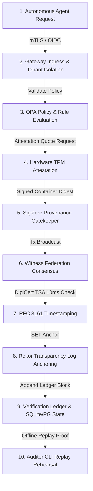

# Nexus ZTAN — 10-Minute Operational & Security Demo

This document outlines the step-by-step walkthrough of the **Nexus ZTAN End-to-End Execution Trace**. It is designed to demonstrate how an autonomous agent transaction flows through the zero-trust coordination pipeline, generates cryptographically signed evidence at each stage, and maps directly to the [Claims Verification Ledger (CLAIMS_VERIFICATION.md)](file:///c:/multiagentic_project/multiAgent-main/CLAIMS_VERIFICATION.md).

---

## 🎭 The Demo Flow at a Glance

The demo tracks a single administrative task initiated by an autonomous operator agent. Every transition is backed by a strict cryptographic check, preventing configuration drift, unauthorized execution, or split-brain state forks.



---

## ⏱️ Step-by-Step Walkthrough

### Step 1: Gateway Ingress & Tenant Isolation
* **What happens**: The autonomous agent initiates a state mutation request (e.g., executing a recovery task). The request lands at the Cluster Gateway via mTLS.
* **Security Control**: Enforces strict client certificate pinning and tenant isolation boundaries using the composite key `(partitionId, deduplicationId)` at the database connection pool level.
* **Code Reference**: [host-daemon.ts](file:///c:/multiagentic_project/multiAgent-main/packages/runtime-core/src/supervisor/host-daemon.ts) / [docker-compose.prod.yml](file:///c:/multiagentic_project/multiAgent-main/docker-compose.prod.yml)

### Step 2: Policy & Rule Evaluation
* **What happens**: The system evaluates the request against active security constraints.
* **Security Control**: Restricts administrative bypass capabilities and enforces the *Separation of Advisory and Execution Invariant*—ensuring that stochastic/AI suggestions are strictly bounded and cannot bypass the deterministic rules.
* **Code Reference**: [INVARIANT_GOVERNANCE_CHARTER.md](file:///c:/multiagentic_project/multiAgent-main/INVARIANT_GOVERNANCE_CHARTER.md)

### Step 3: Hardware Attestation Verification
* **What happens**: The host supervisor generates a hardware attestation quote to prove node integrity.
* **Security Control**: Method `verifyQuote` strictly decodes binary `TPM2B_ATTEST` structures, validating PCR registers (0, 7, 10) against baselines to verify that the host platform has not been tampered with.
* **Code Reference**: [attestation-verifier.ts](file:///c:/multiagentic_project/multiAgent-main/packages/ztan-crypto/src/tpm/attestation-verifier.ts) / [physical-tpm-spec.ts](file:///c:/multiagentic_project/multiAgent-main/packages/governance-core/src/trust/physical-tpm-spec.ts)

### Step 4: Supply Chain & Image Provenance Check
* **What happens**: The supervisor daemon intercepts the request and verifies the container image signature.
* **Security Control**: Executes Cosign-compatible keyless signature verification via Sigstore, validating that the container digest is bound to a legitimate CI identity (e.g., GitHub Actions OIDC assertion).
* **Code Reference**: [mock-cosign.ts](file:///c:/multiagentic_project/multiAgent-main/packages/ztan-crypto/src/sigstore/mock-cosign.ts) / [host-daemon.ts](file:///c:/multiagentic_project/multiAgent-main/packages/runtime-core/src/supervisor/host-daemon.ts)

### Step 5: Witness Federation Consensus
* **What happens**: The transaction is proposed to the Witness Federation.
* **Security Control**: Witness nodes perform multi-node consensus, validating chronological sequence invariants and ensuring that exactly one proposal is processed per sequence ID to prevent split-brain state forks.
* **Code Reference**: [CONSTITUTION.md](file:///c:/multiagentic_project/multiAgent-main/CONSTITUTION.md) / [index.ts](file:///c:/multiagentic_project/multiAgent-main/packages/ztan-witness/src/index.ts)

### Step 6: Cryptographic Time-Stamping (DigiCert TSA)
* **What happens**: The block is stamped with civilization-scale time.
* **Security Control**: Queries the DigiCert TSA server. If local clock drift deviates from the TSA stamp by more than 10ms, the node automatically enters quarantine.
* **Code Reference**: [mock-tsa.ts](file:///c:/multiagentic_project/multiAgent-main/packages/ztan-crypto/src/time/mock-tsa.ts)

### Step 7: Transparency Log Anchoring (Rekor)
* **What happens**: The transaction hash is etched onto the public transparency tree.
* **Security Control**: Generates an append-only Rekor record and validates the Signed Entry Stamp (SET) back from the log to guarantee historical logs cannot be altered.
* **Code Reference**: [mock-rekor.ts](file:///c:/multiagentic_project/multiAgent-main/packages/ztan-crypto/src/time/mock-rekor.ts)

### Step 8: Offline Audit & Replay Rehearsal
* **What happens**: The operator executes a recovery drill to replay transaction history.
* **Security Control**: The Auditor CLI parses the transaction ledger block, recovers the state from cold WAL records, and replays side-effects offline in under 2 seconds to prove full deterministic accountability.
* **Code Reference**: [index.ts](file:///c:/multiagentic_project/multiAgent-main/packages/ztanctl/src/index.ts)

---

## 🚀 Running the Demo Locally

You can run a local simulation of the ZTAN control plane, execute chaos injection, and inspect the resulting cryptographic evidence files.

### 1. Launch the Local Dev Environment
Start the gateway and witness nodes:
```bash
pnpm dev
```

### 2. Verify Node Health and Quorum
Query the local cluster status and inspect the vector clock state:
```bash
pnpm ztanctl diag health
pnpm ztanctl diag vector-clocks
```

### 3. Run a Continuous Survivability Drill
Inject a simulated partition error (such as a database sequence mismatch or network latency spike) to see the system automatically quarantine the affected node:
```bash
pnpm ztanctl recovery drill drift
```

### 4. Execute the Offline Verification Kit
Verify the entire transaction trace to ensure zero database or configuration drift:
```bash
pnpm ztanctl diag diff
```

### 5. Generate the Compliance Scorecard
Display the overall Institutional Continuity score:
```bash
pnpm ztanctl recovery report
```

---

## 📈 Evidence Correlation

| Demo Step | Evidence File / Output | Verification CLI Command |
| :--- | :--- | :--- |
| **Gateway Isolation** | `logs/gateway.log` | `pnpm ztanctl diag health` |
| **TPM Quote Attestation** | `evidence/tpm-attestation-quote.dat` | `pnpm ztanctl infra validate` |
| **Cosign Build Provenance** | `evidence/sigstore-entry.json` | `pnpm test:semantic` |
| **TSA Time Anchor** | `evidence/rfc3161-token.dat` | `pnpm ztanctl diag vector-clocks` |
| **Rekor Transparency Log** | `evidence/rekor-set.dat` | `pnpm ztanctl diag diff` |
| **Drift Detection & Recovery** | `evidence/recovery-audit-*.json` | `pnpm ztanctl recovery report` |
