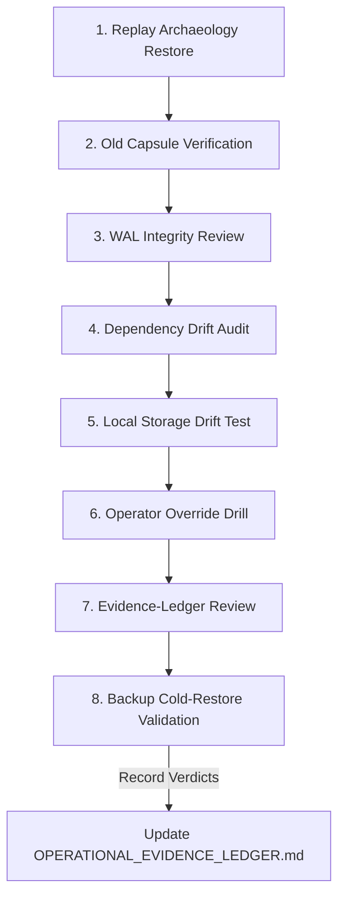

# Nexus ZTAN: Maintenance Era Stewardship Rituals

> [!IMPORTANT]
> **Operational Era: Bounded Observation & Stewardship Freeze**
> ZTAN has formally transitioned from a construction phase to a stewardship phase. Engineering success is now measured exclusively by operational quietness, decadal reliability, and restraint from speculative architectural expansion.

This document establishes the official **Quarterly Operational Checklist** and maintenance rituals required to protect the platform's epistemic boundary and verify its long-term survivability.

---

## 📅 The Quarterly Operational Checklist

Every quarter, active operators of the ZTAN platform must perform the following eight validation rituals. All outcomes, timings, and detected anomalies must be recorded in the [OPERATIONAL_EVIDENCE_LEDGER.md](file:///c:/multiagentic_project/multiAgent-main/.planning/OPERATIONAL_EVIDENCE_LEDGER.md).

### 1. Replay Archaeology Restore
*   **Objective:** Confirm that past execution states can be reconstructed authoritatively from cold ledger logs.
*   **Verification Steps:**
    1. Retrieve a historical sequence block from the cold replay log (`replay_db.json`).
    2. Initialize a local, clean replay instance using `packages/ztan-witness`.
    3. Reconstruct the state machine step-by-step and verify that the final state hash perfectly matches the historical Merkle root.

### 2. Old Capsule Verification
*   **Objective:** Prevent runtime transitions from breaking historical sequence compatibility.
*   **Verification Steps:**
    1. Select a transaction capsule generated in a previous milestone (e.g., v1.5.0/v1.6.0).
    2. Feed this capsule directly into the current, active runtime engine.
    3. Verify that the current deserializer and validator parse the data without syntax errors or unhandled `[SCOPE_BOUNDARY]` exceptions.

### 3. WAL Integrity Review
*   **Objective:** Prevent WAL growth, Autovacuum lockups, or write contention from stalling coordination.
*   **Verification Steps:**
    1. Run `netstat` and Postgres instrumentation queries to check replica lag and autovacuum freeze checkpoints.
    2. Inspect PostgreSQL LSN (Log Sequence Number) alignment between the master and replicas.
    3. Validate that write fencing correctly rejects transactions when simulated replica lag exceeds the 2-second timeout window.

### 4. Dependency Drift Audit
*   **Objective:** Prevent unvetted third-party updates from introducing serializaton or determinism drift.
*   **Verification Steps:**
    1. Run `pnpm audit` and `snyk_code_scan` to monitor vulnerability status.
    2. Check `package.json` lockfile overrides to ensure core packages (`@noble/curves`, `ioredis`, `prisma`, `bullmq`) remain strictly pinned.
    3. Treat any dependency update as a critical archaeology risk event, requiring full re-verification of the group DKG signature PARITY.

### 5. Local Storage & IndexedDB Drift Test
*   **Objective:** Ensure browser persistence boundaries and local state caches remain coherent under storage pressure.
*   **Verification Steps:**
    1. Simulate extreme storage caps (e.g., 50MB IndexedDB limit) in the client context.
    2. Run a continuous sequence write test of 100 attestation signatures.
    3. Verify that the client gracefully fails closed or transitions to the offline local authority mode without corrupting the historical witness timeline.

### 6. Operator Override & Self-Fencing Drill
*   **Objective:** Validate that the system correctly and immediately locks up under operator override or connection loss.
*   **Verification Steps:**
    1. Trigger a simulated Redis network outage using `injectRedisOutage(30000)`.
    2. Attempt a write mutation and verify that the control plane immediately enters `CP Fail-Closed Mode` and rejects the transaction.
    3. Trigger a manual Council HSM multi-sig override and verify that transition logs are securely and non-repudiably committed to the witness log.

### 7. Evidence-Ledger Review
*   **Objective:** Audit the long-term history of anomalies to spot slow, cumulative decay.
*   **Verification Steps:**
    1. Open and review `.planning/OPERATIONAL_EVIDENCE_LEDGER.md`.
    2. Calculate the longitudinal MTTR (Mean Time to Resolution) of all recorded warnings or network interruptions.
    3. Verify that no unresolved "degraded state" flags or silent bypass attempts have been left active.

### 8. Backup Cold-Restore Validation
*   **Objective:** Prove that the platform can be resurrected from absolute scratch by a junior operator.
*   **Verification Steps:**
    1. Completely purge the active dev containers and local Redis/PostgreSQL volumes.
    2. Run the One-Command Recovery tool: `npx tsx scripts/one-command-recovery.ts`.
    3. Verify that the bootstrapped system passes all 8 end-to-end integration tests in the validation scorecard.

---

## 🛡️ The 8 Rules of Restraint

To prevent the gradual reintroduction of **architecture theater** or narrative creep, all operators and future stewards must abide by these permanent rules:

1.  **Freeze Structural Development:** Absolutely no new orchestrational layers, AI modules, or telemetry abstractions are permitted.
2.  **Observe First, Optimize Second:** Allow the system to run quietly for 30-90 days minimum. Gather longitudinal data on WAL growth and cache memory slopes before proposing adjustments.
3.  **Preserve the Epistemic Boundary:** If a capability (like production AI orchestration or multi-region synchronization) is not implemented, keep it explicitly absent using `[SCOPE_BOUNDARY]` throw errors. Never mock operational confidence.
4.  **Slow Entropy Focus:** Focus chaos testing on slow, long-term degradation (browser session timeouts, stale databases) rather than spectacle high-load failures.
5.  **Pin Versioning Aggressively:** Treat every dependency update as a high-risk consensus drift hazard. Lock versions and limit updates to verified security needs.
6.  **Immutable Capsules:** Treat historical transaction logs as sacred, immutable assets. Ensure they can always be replayed cleanly on newer runtimes.
7.  **Prioritize Boring Operations:** Success is defined by the absence of active incidents. Quiet, unremarkable, and operationally boring cycles represent optimal system health.
8.  **Reject Narrative Creep:** Never introduce "temporary" stubs, marketing-driven features, or speculative capabilities. Keep claims strictly aligned with executable truth.

---
**Nexus ZTAN Stewardship Era: Bounded, Honest, and Boring Infrastructure.**
