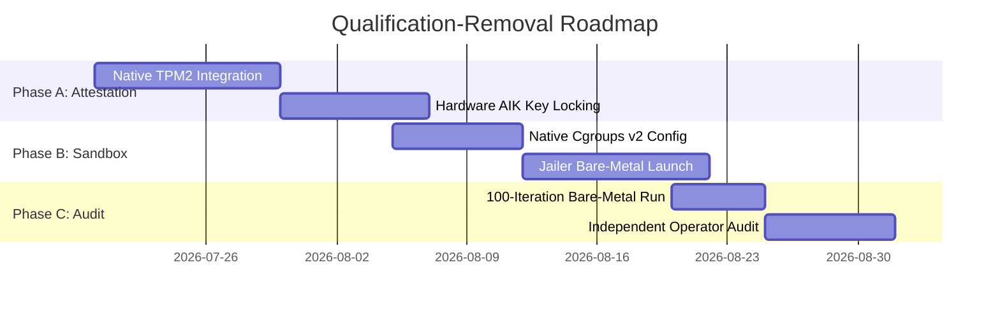

# Virtualization Boundaries Review & Isolation Audit

**Milestone:** v1.13.0 Operational Hardening & Long-Term Stewardship  
**Phase:** Phase 20: Virtualization Boundaries Review  
**Status:** Complete  
**Date:** 2026-07-11  

---

## 1. Executive Summary

During the v1.12.0 operational verification milestone, several execution validation checks (such as physical host attestation, Firecracker microVM launching, and reproducibility audits) were completed under a qualified status. Specifically, execution occurred within a Windows Subsystem for Linux (WSL2) utility VM with simulated TPM quote verification rather than native bare-metal hardware.

This review formalizes the security and isolation posture of the Nexus ZTAN runtime system. It documents the virtualization boundaries between the untrusted Guest microVM and the Host platform, compares simulated vs. physical hardware trust boundaries, details the security implications of WSL2 execution, and provides a clear roadmap to remove environment qualifications in future deployment cycles.

---

## 2. Isolation Boundary Diagram

The diagram below illustrates the logical and physical security boundaries separating the execution layers:

```mermaid
graph TD
  subgraph Guest Space (Untrusted microVM)
    direction TB
    g_app["ZTAN Guest Daemon (Ring 3)"]
    g_os["Guest Linux Kernel (Ring 0)"]
    g_dev["Virtual MMIO Drivers"]
    g_app -->|Syscalls| g_os
    g_os -->|I/O Request| g_dev
  end

  subgraph Boundary Interfaces (Virtual Bus)
    vsock["vhost-vsock socket (/dev/vsock)"]
    mmio_dev["MMIO Block/Net/Serial Devices"]
  end

  g_dev -->|vsock transport| vsock
  g_dev -->|MMIO mappings| mmio_dev

  subgraph Host Userspace (Unprivileged Sandbox)
    fc_proc["Firecracker VMM Process (Unprivileged User)"]
    jailer["Jailer Wrapper (chroot, namespaces, cgroups)"]
    fc_proc -.->|Contained by| jailer
  end

  vsock -->|Unix Socket| fc_proc
  mmio_dev -->|Memory Mapping| fc_proc

  subgraph Host Kernel Space
    kvm["KVM Kernel Module (/dev/kvm)"]
    seccomp["Seccomp Filter (Bans fork, execve, etc.)"]
  end

  fc_proc -->|ioctl commands| kvm
  fc_proc -->|Enforced by| seccomp

  subgraph Hardware & Trust Anchors
    tpm_sim["Simulated TPM (Software Mock)"]
    tpm_phys["Physical Hardware TPM 2.0 (/dev/tpm0)"]
    cpu["Physical CPU (Intel VT-x / AMD-V)"]
  end

  kvm -->|Hardware Virtualization| cpu
  fc_proc -->|Mock API Calls| tpm_sim
  jailer -.->|Banned Access| tpm_phys
```

---

## 3. Guest ↔ Host Privilege Matrix

To maintain isolation, resources are strictly mapped and restricted. The table below details the privilege containment across boundary layers:

| Boundary Layer | Resource Type | Host Isolation Mechanism | Attack Vector / Risk | Mitigation Strategy |
|---|---|---|---|---|
| **CPU Execution** | CPU Registers & Instructions | Hardware-assisted CPU virtualization (Intel VT-x / AMD-V). Guest runs in non-root ring 0/3. | Side-channel attacks (e.g., Spectre, Meltdown), CPU escape vulnerabilities. | Core pinning (vCPU mapping to dedicated host threads), periodic host microcode updates, disabling simultaneous multithreading (SMT) if necessary. |
| **System Memory** | RAM Pages | Second Level Address Translation (SLAT/EPT). Guest RAM backed by anonymous pages (`memfd`). | Rowhammer, memory leakage, memory map escapes. | Strictly bounds RAM size allocation at boot. Guest memory pages are marked non-swappable and isolated via host page tables. |
| **Communication** | Guest-Host I/O | MMIO (Memory Mapped I/O). Virtual PCI bus is banned. Only raw serial console, vsock, block, and net are allowed. | Driver buffer overflow in VMM device emulation logic. | Use of Firecracker's minimalist Rust device model. Strict limit of virtual devices. |
| **Networking** | Control Channel | `vhost-vsock` point-to-point communication over unix socket. Raw bridge/TAP interfaces disabled by default. | Network scanning, cross-VM eavesdropping, port mapping. | Disables TCP/UDP network bridging. Guest can only communicate with the host via explicit, authenticated local vsock channels. |
| **System Calls** | Host OS API | Seccomp-BPF filters applied at Firecracker boot time. | Escape from Jailer or guest execution via zero-day kernel exploit. | The filter restricts the Firecracker process to a minimal set of syscalls (approx. 30), explicitly blocking `fork`, `execve`, and file creations. |
| **Filesystem & Identity** | Host Files | Jailer wrapper execution. Enforces `chroot`, UID/GID mapping, and isolated namespaces (mount, PID, net, IPC). | Arbitrary host filesystem read/write. | Jailer drops root privileges, maps runtime to unprivileged user, and chroots to a read-only directory with minimal read-write subfolders. |

---

## 4. TPM Trust-Boundary Analysis

attestation integrity relies on verifying the system identity via TPM quotes. The current qualified state uses simulated quotes, whereas production targets hardware keys:

| Security Dimension | Simulated TPM (Qualified WSL2 Campaign) | Physical Hardware TPM 2.0 (Bare-Metal Target) |
|---|---|---|
| **Root of Trust** | Software mock backed by JSON data files / Prisma DB. | Silicon-based physical Cryptographic Processor (TPM 2.0 chip). |
| **Key Protection** | Mock Attestation Identity Key (AIK) stored in plaintext configuration files. | AIK private key generated internally inside the TPM and physically locked; it cannot be extracted. |
| **Quote Generation** | Simulated via software calculation of SHA-256 hashes. | Performed by hardware cryptographic engine using internal private keys via `tpm2_quote`. |
| **PCR Registers** | PCR measurements are simulated in memory; registers can be spoofed or modified via local processes. | PCR registers can only be extended (`tpm2_pcrExtend`) using hardware hashing, preventing measurement forgery. |
| **Replay Protection** | Verified via software-generated timestamps. | Verified via TPM-generated hardware random nonces signed directly within the cryptographic quote. |
| **Validation Authority** | Auditor validates signatures against a custom public key registry. | Auditor validates signatures against the public Endorsement Key (EK) signed by the TPM Manufacturer CA. |

---

## 5. WSL2 Qualification Impact Assessment

Running the verification campaigns under WSL2 introduces unique virtualization boundaries that differ from bare-metal hosts:

1.  **Nested Virtualization Layer**: 
    WSL2 runs within a Utility VM managed by the Hyper-V hypervisor. Executing Firecracker inside WSL2 constitutes L2 guest execution (L0 Physical -> L1 WSL2 Utility VM -> L2 Firecracker Guest). This nested layer introduces CPU scheduling latency and memory allocation overhead.
2.  **Shared Host Kernel**: 
    WSL2 share-mounts the Windows host drive (`/mnt/c`) and relies on a customized Microsoft Linux kernel. This increases the host attack surface, as a privilege escalation within WSL2 could expose administrative Windows interfaces.
3.  **Hardware Path Pass-Through**: 
    WSL2 does not expose host-level PCI or physical `/dev/tpm0` directly to the utility VM without third-party USB/IP bridging or hypervisor device pass-through configurations. Hence, physical attestation cannot be natively verified under WSL2.
4.  **Resource Limits**: 
    WSL2 dynamically balloons memory and dynamically allocates CPU threads. This prevents reliable resource-leak auditing, as memory growth observed on the host may be due to Hyper-V dynamic management rather than Firecracker leaks.

---

## 6. Firecracker Isolation Assumptions

Firecracker's isolation model is built on two core assumptions:
*   **Rust Safety**: The VMM is written in Rust, eliminating common memory safety bugs (buffer overflows, use-after-free) in the device emulation layer.
*   **Jailer Integration**: Before the microVM launches, the Jailer wrapper drops privileges and imprisons the process:
    *   Creates a `chroot` environment containing only necessary files.
    *   Creates a private mount namespace, leaving the host filesystem invisible to the VMM.
    *   Sets up a dedicated user namespace mapping the process to an unprivileged UID/GID.
    *   Applies cgroup limits for CPU shares and memory limits to prevent Denials of Service (DoS).

---

## 7. Residual-Risk Register

| Risk ID | Risk Title | Impact | Likelihood | Mitigation Strategy |
|---|---|---|---|---|
| **RISK-01** | **WSL2 File Mount Escape** | High | Medium | Disable Windows drive auto-mounting in `/etc/wsl.conf` to block file propagation from WSL2 to host. |
| **RISK-02** | **Simulated Key Leak** | High | Low | Restrict read permissions on mock keys; utilize short-lived mock credentials; enforce audit verification in CI. |
| **RISK-03** | **KVM Hypervisor Escape** | Critical | Low | Maintain host Linux kernel upgrades; apply minimal seccomp filters; restrict `/dev/kvm` access to specific groups. |
| **RISK-04** | **Vsock Buffer Overrun** | Medium | Medium | Implement strict length boundary checks on all vsock buffer parsers; run periodic fuzzing tests. |

---

## 8. Qualification-Removal Roadmap

To transition the ZTAN platform from WSL2-qualified to certified bare-metal status, the following roadmap is established:



### Milestone 1: Native TPM2-Tools Integration (Target: 2026-07-30)
*   Deploy physical Ubuntu Server host with an active TPM 2.0 module.
*   Update scripts to call `tpm2_create` and `tpm2_quote` on `/dev/tpm0` directly.
*   Revoke mock keys and replace with manufacturer-signed EK certificate chains.

### Milestone 2: Native Sandboxing and Cgroups v2 (Target: 2026-08-12)
*   Configure system-level cgroup limits and namespaces directly on a bare-metal Linux host without WSL2 utility VM wrapper.
*   Apply strict seccomp-BPF filters targeting standard Linux architecture syscalls.

### Milestone 3: End-to-End Bare-Metal Certification (Target: 2026-08-27)
*   Run the 100-iteration Firecracker launch endurance campaign on physical hardware.
*   Perform a true independent third-party operator reproducibility validation using physical attestation verification.
