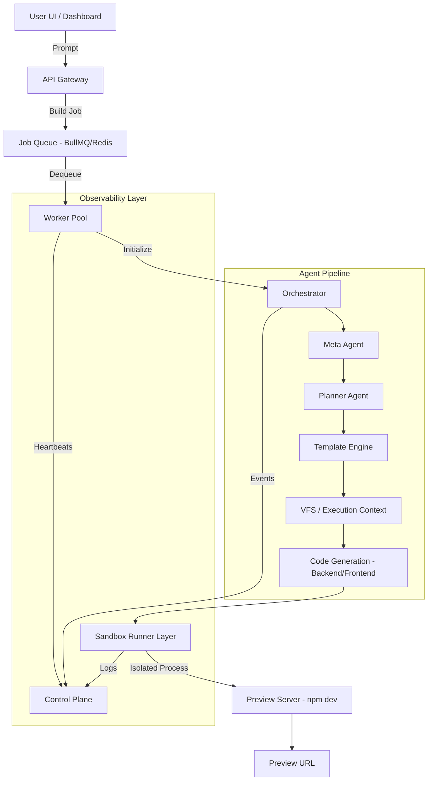

# MultiAgent Platform Architecture

This document specifies the end-to-end technical architecture of the MultiAgent system, designed for high-concurrency, isolated, and observable distributed builds.

## 1. End-to-End System Flow

## 2. Core Components

### API & Gateway (app/)
- **Endpoints**: `/api/build`, `/api/system-health`, `/api/queue-health`, `/api/workers`.
- **Role**: Entry point for user requests and monitoring telemetry.

### Distributed Orchestrator (services/orchestrator.ts)
- **Role**: Managing the high-level agent lifecycle. It is state-aware and uses the `DistributedExecutionContext` to allow for crash recovery.

### Virtual File System (services/vfs/)
- **Role**: An in-memory/Redis backed abstraction for file operations. Ensures that code generation is decoupled from the physical disk until the final runner stage.

### Sandbox Runner (services/runtime/sandbox-runner.ts)
- **Role**: Process-level isolation for heavy tasks (`npm install`, `Docker build`). Includes a watchdog timer and resource monitoring.

## 3. Production Directory Structure (25-Folder)

To ensure maintainability as the platform grows, the codebase is organized into these primary domains:

1. **/app**: Next.js routes and frontend pages.
2. **/agents**: Specialized AI agent logic (Meta, Planner, etc.).
3. **/services/orchestrator**: Pipeline coordination logic.
4. **/services/vfs**: Virtual File System and Snapshotting.
5. **/services/task-engine**: Graph execution and agent registry.
6. **/services/runtime**: Isolated execution and sandbox runners.
7. **/services/devops**: Infrastructure provisioning and CI/CD.
8. **/workers**: Distributed worker process entry points.
9. **/queue**: Redis/BullMQ connection and job definitions.
10. **/config**: Global settings, environment variables, and loggers.
11. **/types**: Shared TypeScript interfaces and enums.
12. **/utils**: Common helper functions.
13. **/scripts**: Maintenance, migration, and stress-testing scripts.
14. **/templates**: Base application starting points.
15. **/docs**: Developer guides and specifications.
16. **/brain**: System design artifacts and implementation plans.
17. **/test/unit**: Unit tests for core services.
18. **/test/integration**: End-to-end and chaos tests.
19. **/public**: Static assets for the frontend.
20. **/styles**: Global CSS and theme tokens.
21. **/components**: Reusable React components.
22. **/hooks**: Shared React hooks for data fetching.
23. **/lib**: External library wrappers and clients.
24. **/infra**: Terraform or Docker-compose configurations.
25. **/.sandboxes**: Temporary execution directories (ephemeral).

## 4. Stability & Recovery
- **Watchdog**: Active monitoring of worker health and sandbox resource usage.
- **Failover**: Automatic job re-queuing if a worker node heartbeats stop.
- **VFS Snapshots**: Checkpoint-based recovery allowing builds to resume from any stage.
