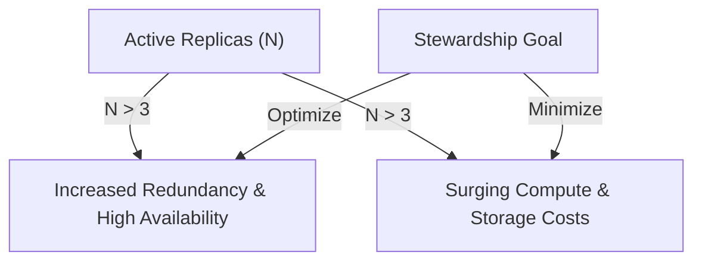

# Economic Sustainability & Fiscal Audit Guide

This guide establishes the economic stewardship principles, resource optimization patterns, and cost-efficiency benchmarks for ZTAN institutional platform administrators.

## 1. The Redundancy/Cost Trade-off

Sovereign trust and high survivability require active, multi-node replication. However, maintaining redundant replication gateways incurs high compute and networking expenses.



Our fiscal optimization engine tracks this trade-off using three core KPIs:
1. **Monthly Compute Cost**:
   $$\text{Cost} = N_{\text{replicas}} \times \$450 \text{ USD/month}$$
2. **Redundancy Overhead Percentage**:
   $$\text{Overhead} = (N_{\text{replicas}} - 3) \times 33.3\% \quad (\text{for } N > 3)$$
3. **Efficiency Ratio**:
   $$\text{Efficiency} = 1 - \frac{\text{Waste Percentage}}{100}$$

---

## 2. Long-Term Rationality Thresholds

A deployment is deemed **Sustainable** and economically rational over a 10-year horizon only if it meets these constraints:

* **Monthly Cost Cap**: Total redundant compute overhead must not exceed **$5,000 USD** per institution.
* **Minimum Efficiency Ratio**: The computed efficiency ratio must remain **$\ge 0.55$** (meaning redundant compute waste is kept below 45%).

If either threshold is violated, `ztanctl audit economic-sustainability` will flag the deployment as `UNSUSTAINABLE` and advise SREs to downscale idle replication instances.

---

## 3. Dynamic Optimization & Cost Control

Operators can audit cluster efficiency at any time:
```bash
ztanctl audit economic-sustainability --institution SOVEREIGN-NEXUS
```

### Actionable Remediation Paths
* **For High Waste (> 40%)**:
  Evaluate active gateway replication metrics using SRE diagnostic tools. If a cell's traffic is low, consolidate gateways to shared co-located cells.
* **For High Compute Cost (> $5k)**:
  Reduce active replica count to $N = 3$, which represents the minimum viable quorum required for strict BFT/consensus finality without wasting institutional capital.
