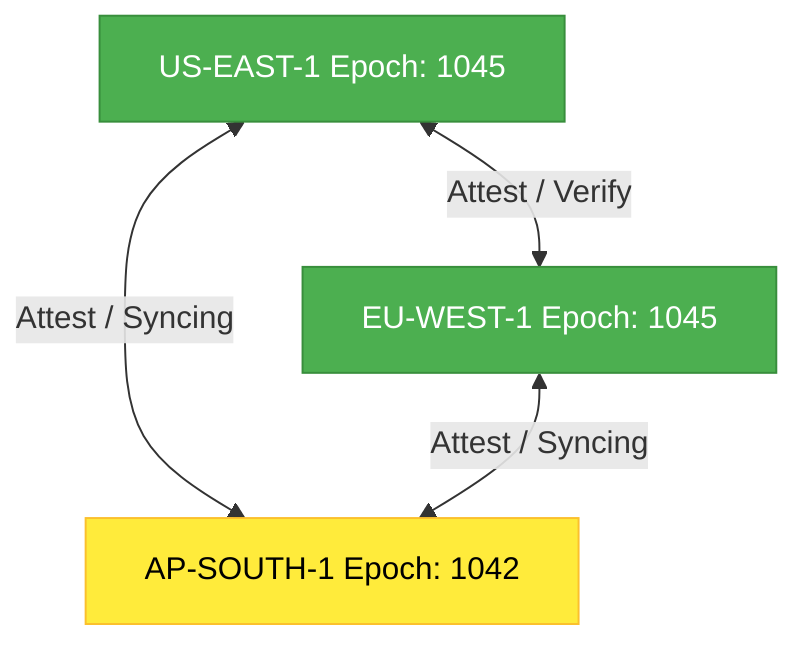

# Invariant Consensus Protocol (Simulated Multi-Region Model)

The **Invariant Consensus Protocol (ICP)** functions as a simulated multi-region consensus model. It provides a local verification framework to model how decentralized regional partitions and federated coordinators would reach epoch-level consensus on the interpretation of core system invariants.

---

## 1. Multi-Region Consensus Simulation Topology

To validate multi-node checkpoint synchronization and test split-brain failure boundaries in a controlled environment, the framework simulates three primary coordinating regions as static, in-memory components:
1. **US-EAST-1** (Simulated Active Coordinator)
2. **EU-WEST-1** (Simulated Active Coordinator)
3. **AP-SOUTH-1** (Simulated Syncing/Attesting Node)

---

## 2. Simulated Dynamic Verification Loop

When the simulation runs an invariant check (modeled as `ztanctl federation invariant-check <invariant>`), the framework triggers the following modeled steps:

1. **Local Resolution**: Resolve the localized term for the invariant key using the simulated Semantic Bridge Registry.
2. **Quorum Query Simulation**: Query the in-memory state of the simulated regional nodes to check if the resolved invariant condition holds in their current simulated epoch.
3. **Simulated Epoch Compatibility Check**:
   - If regional epochs match perfectly, the simulated nodes return a positive attestation for the invariant's integrity.
   - If a node is lagging in epoch (e.g. `AP-SOUTH-1` is simulated at epoch `1042` while others are at `1045`), it is modeled as unable to safely attest to the latest state. The simulated consensus ratio degrades (e.g. `2/3` or `67%`).
4. **Notarization & Hashing (Simulated)**:
   - The consensus outcome, simulated signers, block height, and agreement ratio are serialized and hashed using `SHA-256`.
   - The resulting **Simulated Notarization Hash** is saved in the local test log for auditability.

---

## 3. Simulated Consensus States

| Status | Simulated Agreement Ratio | Operational Action (Simulation Boundary) |
|---|---|---|
| **`CONSENSUS_REACHED`** | **`1.0`** (100%) | Simulated state transitions proceed. Invariant interpretation is locked for this block in the simulation. |
| **`DIVERGENT`** | **`0.5` to `0.99`** | Warning logs are produced. The simulated lagging node is marked for rapid outbox synchronization. High-risk mutations are blocked in the affected simulated region. |
| **`NEGOTIATION_REQUIRED`** | **`< 0.5`** | State transitions halt immediately in the simulation. Emergency operational quarantine is simulated. An operator is notified to run a recovery script. |

---

## 4. Security: Simulated Safeguards

To model security threats and mitigation strategies within the local simulation, the framework implements the following rules:
- **Simulated Reputation-Weighted Quorum**: Lagging or out-of-sync nodes have their voting weight slashed within the simulation logic if they fail to align with the canonical Genesis ledger.
- **Simulated Fail-Closed Semantics**: If a critical invariant (like `MONOTONIC_SEQUENCE`) falls below `1.0` consensus inside the simulation, the framework suspends cross-border transactional routing to model state protection.
