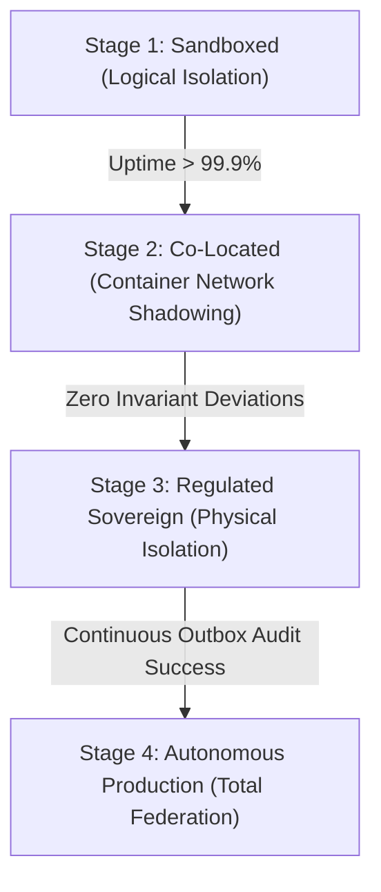

# Operational Maturity Model for Institutional Pilots

This document establishes the SRE framework and progression criteria for graduating ZTAN institutional shadow-pilot cells to fully active, high-assurance production network boundaries.

## 1. Lifecycle Progression Framework



The progression pathway maps structural isolation layers against empirical SRE confidence milestones:

| Lifecycle Stage | Isolation Boundary | Target Availability | Primary Validation Authority | Key Verification Metrics |
| :--- | :--- | :--- | :--- | :--- |
| **Stage 1: Sandboxed** | Bounded logical processes, in-memory ledger simulation | `99.9%` uptime | Local SRE Operator | Deterministic replay of standard mutations; outbox drift < 50ms |
| **Stage 2: Co-Located**| Docker network/Kubernetes namespace shadow partition | `99.95%` uptime | Compliance Officer | Zero double-allocation events; recovery latency < 2000ms |
| **Stage 3: Sovereign**  | Physical node partitions, dedicated WAL replicas | `99.99%` uptime | Independent Auditor | Zero WAL gap corruption events; recovery execution under 1000ms |
| **Stage 4: Federated**  | Multi-region, dedicated sovereign consensus nodes | `99.999%` uptime | Multi-Org Governance | Inter-regional consensus alignment score > 98% |

---

## 2. Dynamic Calibration and Operator Feedback

Every automated reliability recommendation requires strict **Human Trust Calibration** through the SRE CLI:
```bash
ztanctl pilot calibrate <accept | reject | modify> --id <recommendationId> --reason "Contextual alignment with regional policies"
```

A pilot cannot advance to Stage 3 unless its **Human Trust Score** remains above `0.80`, indicating that at least 80% of automated autonomous actions have been approved by human operators or resolved with zero intervention friction.

---

## 3. Mandatory Rollback and Abort Protocols

Under critical failure drift conditions, operators are authorized to invoke a hard reversion to the canonical baseline:

1. **Cell Degradation**:
   If a cell's health status drops to `CRITICAL` or `DEGRADED`, traffic is instantly rerouted to co-located fallback nodes while SREs run `ztanctl recovery status`.
2. **Global Abort**:
   When active adversarial attacks corrupt WAL integrity, the Global Abort protocol halts all pilot activities:
   ```bash
   ztanctl pilot abort <pilotId>
   ```
   All shadow namespaces are demolished, database-level transactions are restricted to read-only, and state rolls back to the last verified cryptographic checkpoint.
