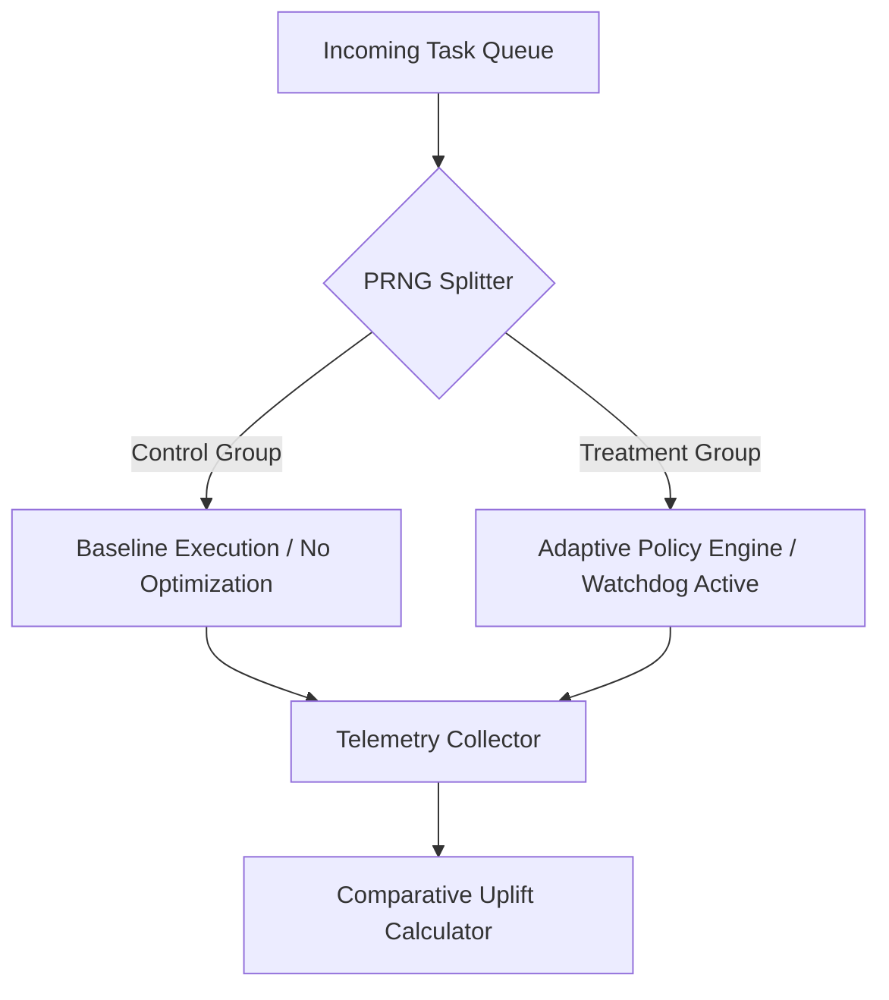

# SRE Experimental & Statistical Validation Methodology

This document outlines the statistical framework, experimental controls, and mathematical assumptions underpinning the telemetry metrics reported in the MultiAgent SRE Validation Matrix. 

For the live validation matrix, see the [Authoritative SRE Validation Matrix](file:///c:/multiagentic_project/multiAgent-main/docs/SRE_VALIDATION_MATRIX.md).

---

## 🔬 1. Experimental Design & Workload Realism

To ensure telemetry represents real-world performance bounds under simulated load, we enforce strict workload and queueing models.

### Workload Realism Assumptions
- **Transaction Distribution**: Incoming job submissions are modeled as a non-homogeneous Poisson process to simulate bursty load spikes typical of user behavior.
- **Transactional Profile**: The workload simulates read-heavy query profiles (80% read, 20% write) utilizing PostgreSQL row-level locks (`SELECT FOR UPDATE`) to stress concurrency constraints.
- **Database Sizing**: Benchmarks are run against a standardized dataset size (100,000 baseline ledger entries) to ensure indexes are fit and query planner paths match production behavior.

### Sample Generation Methodology
- **Minimum Sample Count ($N \ge 200$)**: Required to ensure statistical power for Brier score stabilization and tail risk (P95 regret) calculations.
- **Warmup Phase**: telemetry collection begins only after a 10-second warmup period, allowing V8 JIT compilation and database connection pools to stabilize.

---

## 🎛️ 2. Randomization & Control Assignments

To prevent selection bias and ensure reproducible failure injection, all experiments utilize strict randomization controls.

### Randomization Controls
- **Chaos Injection**: Latency injections, process terminations, and packet loss rates are governed by a seed-based pseudorandom generator (`PRNG` with seed propagation). This ensures that a given chaos run can be replayed identically for regression tracing.
- **Jitter Ranges**: Randomized network latency is bound between 50ms and 1500ms using a uniform distribution.

### Treatment vs. Control (Canary Hold-out)

- **Assignment**: Incoming tasks are routed to the Treatment group (optimized by the active SRE policy engine) or the Control group (default baseline execution, hold-out) using a hash of the `TaskId` combined with a salt.
- **Zero-Interference**: Control tasks are run on separate worker threads/nodes to prevent resource contention from contaminating the baseline performance metrics.

---

## 📊 3. Statistical Formulations

### Brier Score (Calibration Accuracy)
The calibration of the reliability predictor is verified using the multi-category Brier score formulation:
$$BS = \frac{1}{N} \sum_{t=1}^{N} \sum_{i=1}^{R} (p_{ti} - o_{ti})^2$$
Where:
- $p_{ti}$ is the predicted probability of failure scenario $i$ at step $t$.
- $o_{ti}$ is the actual binary outcome ($1$ if occurred, $0$ if not) for scenario $i$ at step $t$.
- $R$ is the number of possible outcomes (e.g., Success, Recovered, Failed).

### Comparative Uplift (Canary A/B)
The observed financial/operational uplift is calculated as:
$$\text{Uplift} = \mu_{\text{treatment}} - \mu_{\text{control}}$$
Where:
- $\mu_{\text{treatment}}$ is the mean net savings of the treatment group.
- $\mu_{\text{control}}$ is the mean net savings of the control group.

### Confidence Intervals & Hypothesis Testing
- **Confidence Intervals (95% CI)**: Computed using the standard error of the mean under a normal approximation, assuming central limit theorem adherence due to $N \ge 200$:
  $$CI_{95} = \text{Uplift} \pm 1.96 \sqrt{\frac{\sigma^2_{\text{treatment}}}{N_{\text{treatment}}} + \frac{\sigma^2_{\text{control}}}{N_{\text{control}}}}$$
- **Significance Threshold**: The null hypothesis ($H_0: \text{Uplift} = 0$) is rejected if $p < 0.05$ using a two-tailed Welch's t-test (which does not assume equal variances between groups).

### Risk Bounds (P95 Regret)
- **Regret Calculation**: For each step, regret is defined as the opportunity loss (difference between the optimal post-hoc action and the action taken).
- **P95 Metric**: The P95 regret represents the 95th percentile of the empirical regret distribution, isolating tail risk under extreme chaos.

---

## 🚫 4. Bias Controls & Regression Assumptions

For these statistical models to be valid, the following regression assumptions are monitored and enforced:

| Assumption | Hazard | Mitigation |
| :--- | :--- | :--- |
| **Independence of Observations** | Autocorrelation of response times under queuing backpressure. | Tasks are separated by randomized pacing intervals to prevent queue-build correlation. |
| **Homoscedasticity** | Variance increases during extreme chaos runs. | Welch's t-test is utilized as it is robust to unequal variances. |
| **Survivor Bias** | Force-terminated tasks are omitted from the metrics. | All killed tasks are recorded as maximum-cost failures, preserving the negative outcome bounds. |

> [!WARNING]
> **Simulated vs. Physical Reality Boundary:**
> These controls verify statistical validity *within the simulated chaos model*. They do not eliminate bias introduced by unmodeled physical variations (such as host OS hypervisor scheduling anomalies or physical network hardware packet routing logic).
