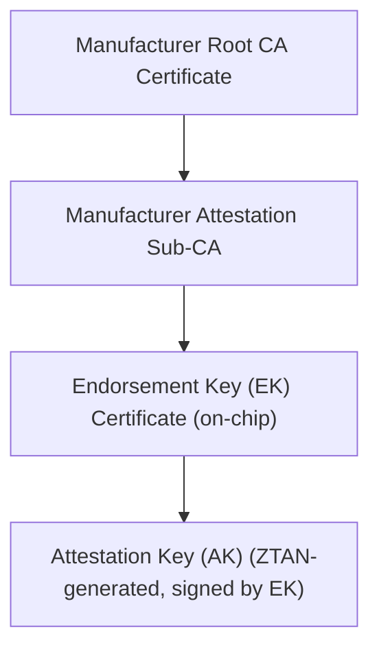

# Nexus ZTAN: Physical TPM 2.0 Archaeology & Forensic Specification

This document provides architectural standards and diagnostic runbooks for validating physical TPM 2.0 hardware modules, measured boot event log lineages, and endorsement credential validation protocols.

---

## 1. Physical TPM 2.0 Hardware Inspection

To ensure the trust layer interacts with a physical silicon security module rather than a hypervisor-mode software mock (vTPM), ZTAN audits the physical hardware interface.

### 1.1 Device Interface Audit
Inspect the system's ACPI tables and TPM character device nodes:

```bash
# Check device drivers
dmesg | grep -i tpm
# Expected: tpm_tis ... TPM 2.0 Device (device_id=..., vendor_id=...)

# Check character device interfaces
ls -l /dev/tpm*
# Expected:
#   /dev/tpm0 - Direct character device (requires root/sys_admin privileges)
#   /dev/tpmrm0 - Resource manager device (recommended for multi-tenant access)
```

---

## 2. Endorsement Key (EK) & Attestation Key (AK) Mappings

Unlike soft keys, the Endorsement Key (EK) is burned into physical silicon during chip manufacturing. ZTAN validates this lineage by climbing the manufacturer's PKI tree.



### 2.1 Extracting and Validating the Silicon EK Certificate
Perform the following extraction to pull the chip-level X.509 certificate and verify it against vendor certificate authorities (e.g., Infineon, Intel, STMicroelectronics):

```bash
# 1. Read Endorsement Key certificate from TPM non-volatile storage (NV Index 0x01c00002)
tpm2_nvread -C o 0x01c00002 --output=ek_cert.der

# 2. Convert to PEM format
openssl x509 -inform der -in ek_cert.der -out ek_cert.pem

# 3. Pull public key from certificate
openssl x509 -in ek_cert.pem -pubkey -noout > ek_pub.pem

# 4. Verify EK signature against Vendor root CA certificates
openssl verify -CAfile vendor_root_ca.pem -untrusted vendor_intermediate_ca.pem ek_cert.pem
```

---

## 3. Measured Boot Event Log Parsing (`binary_bios_measurements`)

A TPM quote is cryptographically secure but lacks context unless verified against the TCG Event Log lineage.

### 3.1 Inspecting the Binary Event Log
On native Linux hosts, ZTAN reads the raw ACPI/BIOS event sequence from securityfs:

```bash
# Verify securityfs mounting
mount | grep securityfs
# Expected: securityfs on /sys/kernel/security type securityfs

# View binary BIOS measurement stream
hexdump -C /sys/kernel/security/tpm0/binary_bios_measurements | head -n 20
```

### 3.2 TCG Event Structure Audit
Every entry in the event log must satisfy the canonical format:

```text
+-----------------------------------------------------------+
| PCR Index (4 Bytes) | Event Type (4 Bytes) | Digest (20-32 Bytes) |
+-----------------------------------------------------------+
| Event Data Size (4 Bytes) | Event Data (Variable Length)    |
+-----------------------------------------------------------+
```

ZTAN's `PhysicalTpmConnector` parses this stream to reconstruct the PCR digest chain. A mismatch between the computed hash of the event log and the actual PCR value returned by `tpm2_quote` instantly flags a **History Tampering Event**, putting the platform into immediate fail-closed lock.

---

## 4. Hardware Drift, Latency, & Rollback Vulnerability Studies

Operators should stress-test the hardware boundary to discover physical limitations.

### 4.1 Quote Generation Latency Audits
Unlike simulated software cryptographic mocks which execute in microseconds, physical silicon quotes incur severe serial bus (I2C/SPI) latencies. Operators must benchmark this overhead:

```bash
# Measure average execution time of a physical hardware quote
time tpm2_quote --ak-context=ak.ctx --pcr-list=sha256:0,7 --qualification=0xabcdef --message=quote.dat --signature=sig.dat
# Typical hardware latency: 150ms - 450ms
# Simulated fallback latency: < 1ms
```
Any latency drop below **10ms** on native runs is automatically flagged as a **Virtualization Mock Bypass Attack** (attempting to swap a physical TPM with a mock software wrapper).

### 4.2 Suspend / Resume & Clock Rollback Edge Cases
Physical TPMs contain an internal monotonic clock. If a physical host enters low-power suspend states (S3/S4), the clock may drift.
1. Force system sleep: `sudo systemctl suspend`
2. Wake the system and immediately trigger a ZTAN witness integrity check.
3. Assert that:
   - Nonce challenge verification enforces strict expiration bounds (< 5 minutes).
   - If the TPM's internal clock drifts past host NTP bounds, a temporal rollback alarm is fired, locking the ledger.
