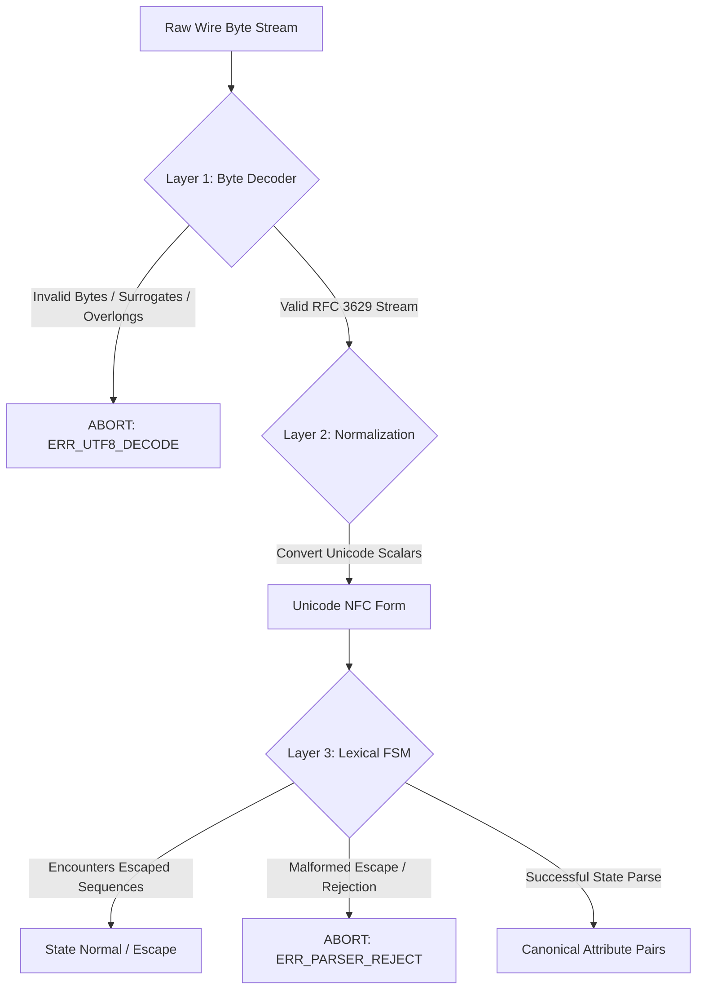
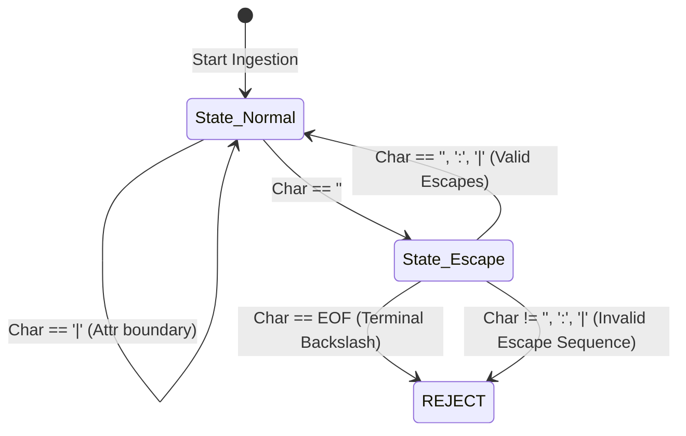
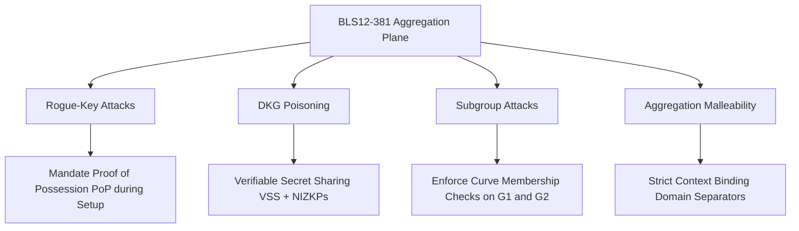
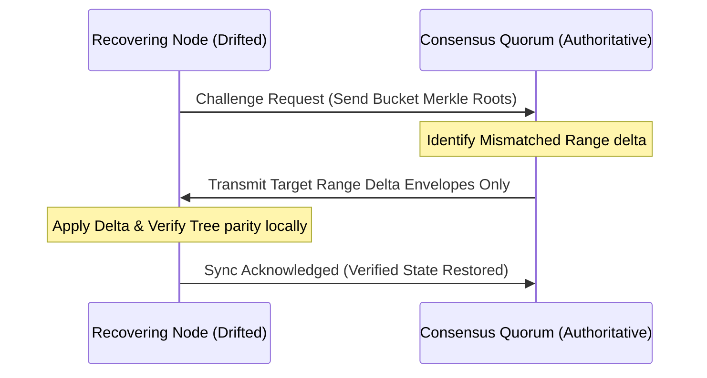

# ZTAN-ATP: Autonomous Trust Protocol Specification
## Version: 1.0.0-PROPOSAL // Category: Operational Trust Infrastructure
## Status: RIGOROUS ARCHITECTURAL SPECIFICATION & DRAFT STANDARD 🛡️

---

## 🏛️ 1. Executive Summary & Philosophy

This document defines the normative wire formats, serialization invariants, and cryptographic validation requirements of the **Autonomous Trust Protocol (ZTAN-ATP)**.

ZTAN-ATP shifts autonomous safety boundaries from a platform-centric API dependency into a **universal, language-agnostic, and out-of-band verifiable trust substrate**. Other systems MUST be able to verify ZTAN trust assertions locally and offline without making a network round-trip to the validation cockpit.

This document represents an active standards proposal under rigorous operational testing and developer review. It is NOT a finalized standard, and its features are subject to revision based on cross-runtime conformance and fuzzing benchmarks.

> [!NOTE]
> **EPISTEMIC BOUNDARY: DRAFT CONFORMANCE TARGETS VS. ACTIVE SIMULATION**
> - The RFC-style normative keywords (MUST, SHOULD, REQUIRED) used in this specification represent **conformance targets for a proposed draft standard** rather than finalized or production-proven ecosystem guarantees.
> - The underlying system contains evolving and partially simulated distributed components (such as mock gossip routing and simulated threshold key DKG planes).
> - Readers must distinguish between **specification intent** (conformance definitions for future interoperability) and the **validated operational behavior** currently observed in this research-grade environment.

### 1.1 Simplicity Boundaries & Minimal Deployable Core

To prevent specification maximalism and control bespoke protocol surface area, ZTAN-ATP defines a layered architecture. Implementations are NOT required to support all modules to achieve basic compliance. Features are divided into distinct operational tiers:

| Layer | Component | Status | Description |
| :--- | :--- | :--- | :--- |
| **Tier 1: Core Mandatory** | Canonical Serialization (CER v1.5) + Public Key Invariants (SPKI/DER) + ECDSA Signatures | **Mandatory** | The absolute minimum surface area needed to construct and verify out-of-band assertions. |
| **Tier 2: Recommended** | Sliding-Window Replay Protection & Basic Epoch Fencing (Local Cache) | **Recommended** | Bounded temporal checks to mitigate common out-of-sequence replay attacks in single-region setups. |
| **Tier 3: Optional** | BLS12-381 Cryptographic Threshold Signing (DKG) | **Optional** | Advanced pairing-friendly signature aggregation to reduce wire size; falls back to Tier 1 logical quorums. |
| **Tier 4: Experimental** | Gossip-Based Revocation Anti-Entropy & Reputation-Based Peer Routing | **Experimental** | Distributed sync and routing mitigations; subject to high design drift and active simulation limits. |
| **Tier 5: Research** | Formal TLA+/Alloy protocol specifications and algebraic proof verification. | **Proposed Only** | Theoretical models designed for design analysis; completely out-of-scope for runtime execution engines. |

By separating these boundaries, developers can implement and audit the **Tier 1 Core** independently without inheriting the complexity of the experimental or proposed layers.

### Normative Language
The key words **MUST**, **MUST NOT**, **REQUIRED**, **SHALL**, **SHALL NOT**, **SHOULD**, **SHOULD NOT**, **RECOMMENDED**, **MAY**, and **OPTIONAL** in this document are to be interpreted as described in RFC 2119.

---

## 📄 2. Wire Format & Schema Primitives [Tier 1: Core Mandatory]

### 2.1 Protobuf v3 Wire Specification
To minimize network overhead and processing latency, the canonical wire format for transport and RPC interfaces is defined in Protocol Buffers v3.

```protobuf
syntax = "proto3";

package ztan.atp.v1;

enum ActorType {
  ACTOR_TYPE_UNSPECIFIED = 0;
  AUTONOMOUS_AGENT = 1;
  HUMAN_OPERATOR = 2;
  SYSTEM_WORKFLOW = 3;
}

enum RiskClass {
  RISK_CLASS_UNSPECIFIED = 0;
  LOW = 1;
  MEDIUM = 2;
  HIGH = 3;
  CRITICAL = 4;
}

enum TrustVerdict {
  TRUST_VERDICT_UNSPECIFIED = 0;
  CERTIFIED = 1;
  DENIED = 2;
  REQUIRES_HUMAN_QUORUM = 3;
  QUARANTINED = 4;
}

message AutonomousActionEnvelope {
  string action_id = 1;              // Unique UUIDv4 action identifier
  string intent = 2;                 // Human-readable action intent
  string actor = 3;                  // Actor identity URI (e.g., spiffe://domain/agent/7)
  ActorType actor_type = 4;          // Classification of the initiating actor
  RiskClass risk_class = 5;          // Static or dynamic risk score classification
  string policy_version = 6;         // Target governance policy engine version
  string lineage_hash = 7;           // Merkle digest chaining preceding action nodes
  uint64 replay_id = 8;              // Actor-scoped monotonic transaction sequence number
  uint32 required_approvals = 9;     // Quorum size for manual operator authorizations
  repeated string approval_chain = 10; // Array of cryptographically signed operator credentials
  TrustVerdict status = 11;          // Execution safety verdict
  string jurisdiction = 12;          // Sovereign region code (e.g., EU-WEST-1)
  string timestamp = 13;             // Normalized ISO 8601 UTC date string
}

message AuthoritySignatureBlock {
  bytes signature = 1;               // ASN.1 DER-encoded ECDSA signature
  string public_key_id = 2;          // Hex identifier matching key in trust root anchor list
}

message TrustAssertionProof {
  AutonomousActionEnvelope envelope = 1;
  repeated AuthoritySignatureBlock signatures = 2; // Threshold signature set (m-of-n)
  string verification_hash = 3;      // SHA-256 digest of the canonical envelope
}
```

---

## 🔠 3. Deterministic Canonical Serialization (Inspired by RFC 8785) [Tier 1: Core Mandatory]

To support reproducible out-of-band verification parity across multiple runtimes (TypeScript, Go, Rust, Python, C++), the canonical payload MUST be constructed using the following deterministic encoding rules. 

> [!NOTE]
> **RFC 8785 Relation**
> ZTAN-ATP uses a custom pipe-delimited serialization format rather than pure JSON. It is **not** fully JCS-compatible (RFC 8785). Instead, it adopts the cryptographic canonicalization principles of RFC 8785 (ordering, Unicode normalization, zero-mutation encoding) and adapts them to a high-throughput raw wire format.

### 3.1 Custom Delimiter Serialization vs. Self-Describing Formats
*   **Bespoke Pipe-Delimited Syntax Tradeoffs:** Standard self-describing serialization formats (e.g., MessagePack, deterministic CBOR [RFC 8949], or Protobuf) were explicitly bypassed for the signed assertion payload layer. While robust, they introduce binary decoding schema dependencies, parsing complexity, and architectural baggage that impede out-of-band human auditing. Standard JSON Canonicalization Schema (JCS [RFC 8785]) was also rejected because it does not semantically preserve whitespace (which is unacceptable for structured configuration or multi-line agent code).
    However, using a custom pipe-delimited wire format introduces a non-trivial engineering tradeoff: we sacrifice mature, battle-tested standard canonical parsers and native binary efficiency in exchange for dependency minimization, raw transport visibility, and zero-schema human-auditable verification.

> [!WARNING]
> **ARCHITECTURAL WARNING: RISKS OF BESPOKE SERIALIZATION & PARSER SURFACE AREA**
> - **Audit & Parser Risk**: Bypassing established standards like JCS (RFC 8785), deterministic CBOR (RFC 8949), or Protobuf for the signed assertion payload directly increases the parser exploit surface and audit burden. Custom delimiter serialization, custom escaping FSMs, and custom canonicalization are historically prone to implementation divergence and parser differential exploits (where two different runtimes parse the same sequence differently).
> - **Cross-Runtime Rigor**: This custom format shifts the entire burden of UTF-8 byte validation, escape FSM correctness, Unicode normalization (NFC) correctness, and parser-state invariants onto *every* independent runtime implementation (TypeScript, Go, Rust, Python, etc.). Any implementation bug or slight variation in how runtimes handle invalid UTF-8 sequences, escape boundaries, or sorting can lead to interoperability failures or validation bypasses.
> - **Complexity vs. Evidence**: There is a widening abstraction-to-evidence gap between the complex mathematical constraints specified here and the actual validated operational behavior of existing runtimes. Developers are cautioned that bespoke protocol surfaces represent the highest long-term maintenance cost and risk of the ZTAN ecosystem.
*   **Parser Rigor & Grammar Rejection:** Because this wire format relies on escaping delimiters, verifiers MUST NOT treat it as a trivial string split. Instead, it must be parsed using a constrained, single-pass non-recursive lexical automata.
*   **String Encoding:** All string fields MUST be encoded strictly as **UTF-8** byte sequences.
*   **Unicode Normalization:** All string data MUST be normalized to **Unicode Normalization Form C (NFC)** prior to processing.
*   **Strict, Non-Recursive Escaping Rules:** String values containing delimiters `:`, `|`, or backslashes `\` MUST be escaped using a single-pass, non-recursive escaping pass:
    *   `\` becomes `\\`
    *   `:` becomes `\:`
    *   `|` becomes `\|`
    To prevent escape-recursion, delimiter smuggling, and parser state bypasses, any malformed escape sequence (such as an unescaped single backslash `\` at the end of a string, or double-escaping sequences like `\\:` aiming to bypass verification) MUST trigger immediate parser validation failure.
*   **Strict Whitespace Preservation:** String values MUST NOT undergo any whitespace normalization or duplicate inner space truncation. Every space, tab, or newline character MUST be preserved exactly as-transmitted to maintain syntactic fidelity.

### 3.1.1 Standard Serialization Escape Hatches & Interoperability Pathways [Tier 2: Recommended]
*   **Standard Alternative Formats:** To mitigate the parser differential risks associated with custom pipe-delimited serialization, gateway implementations SHOULD support negotiating alternative canonical serialization formats:
    *   **Deterministic CBOR (RFC 8949):** Recommended for binary-efficient, schema-free environments requiring standard canonical parsing support.
    *   **Deterministic Protobuf Encoding:** Recommended for static schema-driven configurations.
    *   **JCS (RFC 8785 JSON Canonicalization Scheme):** Recommended for environments requiring pure text-based JSON interoperability, provided whitespace preservation invariants are handled by out-of-band pre-processors.
*   **Format Negotiation:** When alternative formats are negotiated, the custom escape FSM and pipe-delimited serialization rules specified in Appendix A are bypassed in favor of the respective standard canonicalization rules.

### 3.2 Prohibition of Floating-Point Formats
*   Floating-point primitives (IEEE 754) MUST NOT be used in the signed `AutonomousActionEnvelope` payload.
*   All decimal values MUST be converted to **Fixed-Point Integers** scaled by $10^6$ prior to transmission and serialization. For example, a risk index of `0.8572` MUST be represented and transmitted as the integer `857200`. This eliminates all cross-language precision anomalies, rounding discrepancies, NaN/Infinity representations, and negative zero ambiguities.

### 3.3 Temporal Normalization
*   **Timezone:** All timestamps MUST be normalized to **UTC**.
*   **Format:** The timestamp MUST adhere to **RFC 3339** formatted string syntax, strictly using the uppercase `Z` suffix. Sub-second millisecond fields MUST be truncated to exactly three decimal places (e.g., `2026-05-19T22:00:00.000Z`).

### 3.4 Collections, Maps, and Omitted Fields
*   **Arrays:** Array values MUST be lexicographically sorted in ascending order of their UTF-8 byte representation prior to serialization.
*   **Omitted Fields:** Any field with a `null`, `undefined`, or empty string/array representation MUST be omitted entirely from the serialized payload string rather than rendered as empty delimiters.
*   **Duplicate Keys:** Duplicate key names in any serialized parser stream are strictly forbidden and MUST trigger immediate verification failure.

### 3.5 Lexicographical Attribute Concatenation
The final canonical payload is constructed by sorting all valid key-value string pairs lexicographically by their keys, joining them with `:`, and delimiting by `|`:
```text
actionId:<actionId>|actor:<actor>|actorType:<actorType>|intent:<intent>|jurisdiction:<jurisdiction>|lineageHash:<lineageHash>|policyVersion:<policyVersion>|replayId:<replayId>|riskClass:<riskClass>|status:<status>|timestamp:<timestamp>
```

---

## 🔐 4. ASN.1 DER Public Key Encoding Invariant [Tier 1: Core Mandatory]

To ensure platform SDKs do not fail intermittently due to raw point interpretation variances, ZTAN-ATP public keys MUST be transmitted and parsed strictly as standard **SubjectPublicKeyInfo (SPKI)** structures using **Distinguished Encoding Rules (DER)**.

### 4.1 ASN.1 SubjectPublicKeyInfo Schema
```asn1
SubjectPublicKeyInfo ::= SEQUENCE {
    algorithm         AlgorithmIdentifier,
    subjectPublicKey  BIT STRING
}

AlgorithmIdentifier ::= SEQUENCE {
    algorithm         OBJECT IDENTIFIER, -- 1.2.840.10045.2.1 (id-ecPublicKey)
    parameters        OBJECT IDENTIFIER  -- 1.2.840.10045.3.1.7 (secp256r1 / P-256)
}
```

### 4.2 Raw Key Unwrapping Rules
The standard public key string represents the Hex-encoded SEC1 uncompressed format (65 bytes starting with the prefix byte `0x04`). Verification SDKs MUST parse this point and encapsulate it within the standard DER header:

```text
Sequence [30 59]
  Sequence [30 13]
    Object Identifier (1.2.840.10045.2.1 EC Public Key) [06 07 2A 86 48 CE 3D 02 01]
    Object Identifier (1.2.840.10045.3.1.7 P-256 Curve) [06 08 2A 86 48 CE 3D 03 01 07]
  Bit String [03 42]
    0x00 Prefix + 65-Byte SEC1 Point [04 <Uncompressed Coordinates>]
```

All SDK implementations MUST wrap raw P-256 SEC1 public key coordinate points inside this ASN.1 wrapper before passing them to native host cryptographic libraries.

---

## 🛡️ 5. Partition-Aware Monotonic Replay Protection & Epoch Fencing [Tier 2: Recommended]

ZTAN-ATP establishes a strict **sliding-window monotonic validation framework** designed to prevent duplicate execution attacks while maintaining operational safety across partitioned validator clusters.

### 5.1 The Sequence Counter Invariant
1.  **Actor-Tenant Scope:** The `replayId` is defined strictly as an **Actor-Scoped Monotonic Counter**. Every individual actor URI (e.g., `spiffe://domain/agent/7`) is expected to maintain monotonically increasing execution counters under compliant implementations.
2.  **Stateful Verification:** Verifier nodes MUST persist the last verified sequence number ($C_{\text{last}}$) for each active actor.
3.  **Monotonic Check:** A newly submitted envelope with sequence number $C_{\text{new}}$ is valid if and only if $C_{\text{new}} > C_{\text{last}}$. If $C_{\text{new}} \le C_{\text{last}}$, the action MUST be immediately rejected.

### 5.2 Sliding-Window Timestamp Validation
To prevent stale sequence logs from bloating the validator's local cache indefinitely, envelopes are evaluated against a temporal drift window:
*   **Time Window:** The payload timestamp $T_{\text{action}}$ MUST fall within $\pm 300$ seconds of the validator's system time $T_{\text{now}}$:
$$| T_{\text{now}} - T_{\text{action}} | \le 300 \text{ seconds}$$
*   Any sequence validation state for an actor inactive for more than 300 seconds may be safely pruned, relying on the sliding time-window to intercept stale attacks thereafter.

### 5.3 Formal Epoch Fencing and Partition Recovery
In distributed or partitioned networks, relying on single counter caches introduces split-brain risk. ZTAN-ATP addresses this through **Quorum-Committed Epoch Fences**:
1.  **Epoch Advancement and Authority:** Epochs are strictly advanced by the consensus cluster. An epoch transition requires a signed **Epoch Transition Certificate** generated via a quorum of validators ($>50\%$).
2.  **Epoch Conflicts and Rollback Safety:** If validator partitions drift or generate conflicting epoch transitions, the epoch with the highest quorum signature density is selected. A rollback of epoch transitions is strictly forbidden beyond $E_{\text{last}} - 1$ to prevent history rewriting.
3.  **Malicious Epoch Inflation Mitigations:** Verifiers MUST reject any incoming transition request trying to advance the current epoch by more than $+1$ unit.
4.  **Region Merge Recovery Anti-Entropy:** Upon partition recovery, drifted nodes sync their state via a signed anti-entropy gossip challenge. Nodes that have fallen behind by more than 2 full epochs must block new write operations, trigger a full database-authoritative rebuild, and re-fetch validation checkpoints before resuming active status.

---

## 🕸️ 6. Causal Evidence Graph (DAG) Lineage & Acyclicity Checks [Tier 2: Recommended]

To prevent branching timeline vulnerabilities, ZTAN-ATP formalizes causal dependencies using a **Directed Acyclic Graph (DAG)** of cryptographic lineage.

### 6.1 Parent Order & Concatenation Invariants
If an action $N$ is triggered by multiple causal parents $\{P_1, P_2, \dots, P_k\}$, its `lineageHash` is computed using the following non-commutative steps:
1.  **Extract Digests:** Retrieve the unique SHA-256 verification digests ($H_{P_i}$) of all parent action envelopes.
2.  **Lexicographical Sort:** The parent digests MUST be sorted in ascending lexicographical order as string representations of their hexadecimal digests:
$$\text{Sorted Digests} = \text{sort}\Big( \{ H_{P_1}, H_{P_2}, \dots, H_{P_k} \} \Big)$$
3.  **Binary Concatenation:** Concatenate the sorted parent digests strictly without any separators:
$$\text{Lineage Pre-image} = H_{\text{sorted}, 1} \mathbin{\Vert} H_{\text{sorted}, 2} \mathbin{\Vert} \dots \mathbin{\Vert} H_{\text{sorted}, k}$$
4.  **Final Hash:** Compute the SHA-256 hash of the pre-image:
$$N.\text{lineageHash} = \text{SHA256}(\text{Lineage Pre-image})$$

### 6.2 Crucial Distinction: Causal Membership vs. Temporal Order
> [!IMPORTANT]
> **Lineage Ordering Constraint**
> The lexicographical sorting of parent digests (Section 6.1, Step 2) supports **reproducible lineage derivation** and **reduces canonicalization variance**. 
> However, because lexicographical sorting is non-chronological, the `lineageHash` **DOES NOT preserve true temporal sequence ordering or logical clock causality**.
> *   The DAG operationally models **what parents causally contributed** to an action.
> *   The DAG **does not** prove the *relative temporal sequence* of those parents.

### 6.3 Strict DAG Acyclicity and Computational Bounds
Adversarial circular lineages (e.g. $A \to B \to A$) can lead to infinite recursion, validation stack overflows, and CPU exhaustion.
1.  **Mandatory Ingestion Checks:** Before accepting a new assertion envelope, the verifier MUST execute a cycle detection check (using a Depth-First Search with recursion tracking or Kahn's topological sort algorithm).
2.  **Lineage Depth Limits:** Verifiers MUST reject any assertion lineage graph whose depth exceeds a hard ceiling of **32 recursive parent tiers** ($D_{\text{max}} = 32$).
3.  **Cycle Rejection:** Any cycle detection MUST trigger immediate rejection, key-flagging of the submitting actor, and alert emission to the telemetry console.

---

## 🔑 7. Federated Trust Architecture, Gossip Revocation, and Algorithmic Agility

### 7.1 Threshold Signature Model vs. Threshold Cryptography [Tier 3: Optional]
To prevent cryptographic overstatement, implementations and spec authors MUST maintain a strict distinction between logical validation quorums and aggregated cryptographic schemes:
*   **Logical Multi-Signature Quorum Model (Base):** The default ZTAN-ATP envelope validation represents a quorum validation mechanism where the verifier verifies $m$ independent signatures (e.g. ECDSA P-256) against the known validator list, verifying:
$$\mathrm{Signatures\ Verified} \ge m \quad \left(m = \lfloor n/2\rfloor+1\right)$$
*   **Cryptographic Threshold Signature Variant (Extended):** For high-throughput platforms supporting native pairing-friendly curves, the protocol specifies an optional cryptographic threshold signature scheme using **BLS12-381 Threshold Cryptography**. This involves distributed key generation (DKG) and Shamir secret-sharing to construct a single aggregated signature verifyable against a singular, static group public key, dramatically reducing wire size and CPU cost.

### 7.2 Gossip Revocation and Eventual-Consistency Hardening [Tier 4: Experimental]
Under network partitions, gossip propagation is eventually consistent, introducing a risk window where a revoked validator key remains active locally:
1.  **Revocation Precedence:** Key revocation certificates (CRMs) strictly override and invalidate any signature produced by that key, regardless of the timestamp claims on the assertion.
2.  **Revocation TTL:** CRMs have an infinite lifetime within the validator network; once a key is revoked, its status MUST remain permanently written in the local `TRUST_ANCHORS.json` blacklist.
3.  **Offline Verifier Behavior:** If an offline or intermittently connected verifier has not successfully synced its key revocation database for more than 24 hours ($T_{\text{max\_stale}} = 86400 \text{s}$), it MUST downrate its validation state to **Quarantined** and reject high-risk transactions.
4.  **Split-Brain Resolution:** If conflicting key anchor updates are received, the update possessing the highest epoch certificate index and signed by an absolute majority of remaining validators is applied.

### 7.3 Protocol Version Negotiation and Algorithmic Agility [Tier 1: Core Mandatory]
To support seamless runtime upgrades and cryptographic migration without network disruption:
1.  **Capability Advertisement & Version Negotiation:** All trust exchange handshakes MUST advertise their supported protocols (e.g., `ZTAN-ATP/1.0`, `ZTAN-ATP/2.0`). Runtimes MUST negotiate downward to the highest mutually supported version.
2.  **Hash Algorithm Agility:** To mitigate future SHA-256 weaknesses, the protocol supports an explicit transition strategy. The schema includes a hash type prefix in the lineage identifier (e.g., `sha256:` or `sha3:`). Runtimes MUST reject unrecognized hash types, preventing downgrade attacks to deprecated hashes.
3.  **Signature Migration Lifecycle:** When migrating from ECDSA P-256 to post-quantum signature schemes (e.g., ML-DSA), the `AuthoritySignatureBlock` supports a polymorphic signature block. Verifiers support dual-signature verification periods where both traditional and post-quantum signatures are validated concurrently during a transitional grace epoch.

---

## 🛰️ 8. Threat Model, Attacker Matrix, and Gateway Operational Qualification [Cross-Tier]

### 8.1 Threat Mitigation Matrix
| Attacker Class / Threat Vector | Description | ZTAN-ATP Mitigation Prerequisite |
| :--- | :--- | :--- |
| **Out-of-Sequence Replay** | Adversary intercepts a signed envelope and attempts to re-execute it. | **Actor-Scoped Monotonic Counter + Sliding Window Check:** Verified $C_{\text{new}} \le C_{\text{last}}$ state-machine intercept, bounded by a 300s window. |
| **Divergent Serialization** | Attacker crafts a payload that parses differently across runtimes, forging a signature validation bypass. | **NFC Normalization + Single-Pass Escaping + Whitespace Preservation:** Enforces identical canonical formatting before hashing without mutating semantic bytes. |
| **Commutative DAG Tampering** | Attacker attempts to flip the execution sequence of parent agents $P_1$ and $P_2$. | **Lexicographical Parent Digest Ordering:** Concatenation sorting constrains canonicalization variance and supports reproducible lineage derivation regardless of ingestion timing. |
| **Validator Key Compromise** | An attacker steals the private signing key of a ZTAN Validator node. | **Multi-Signature Threshold Quorum Verification:** Critical transactions require independent signatures from multiple distinct trust roots. |
| **Adversarial Timestamp Forgery** | An agent's local clock is manipulated backwards to replay historic transactions. | **Bounded Drift Validation window:** Strict $\pm 300\text{s}$ wall-clock fence relative to the validating node's clock. |
| **Temporal Sequencing Bypasses** | Attacker claims parents $A$ and $B$ occurred in a different order to bypass safety rules. | **Temporal Ordering Invariant Note:** Restricts developers from using raw Merkle hashes for time logic, mandating explicit vector clocks. |
| **Cyclic Lineage Floods** | Attacker injects recursive parent references to lock up the verifier's validator thread. | **Strict Acyclicity Verification + Depth Fencing:** Ingestion DFS cycle checks with a hard limit of 32 parent tiers. |
| **Downgrade Attacks** | Attacker intercepts connection to force fallback to deprecated versions or hashes. | **Capability Advertisement + Strict Hash Prefix Agility:** Banning downgrade attempts to deprecated algorithms. |

### 8.2 Operational Qualification Constraints
*   **Compile-Time Verification vs. Runtime Resilience:** While ESM compliance, type-only imports, and strict TypeScript compilation are fully achieved in the gateway codebase, they do not prove runtime resilience.
*   **Production Deployment Targets:** Prior to enterprise deployment, gateway runtimes SHOULD be qualified using empirical load testing (verifying target benchmark bounds such as 2000 req/sec under a specified reference profile: e.g., 8-core CPU, 10Gbps local network, no-op cryptographic verification bypass, and standard memory-only database persistence), active backpressure verification (validating client throttling when DB/cache limits are reached), failure injection (simulating HSM time-outs and connection drops), and memory profiling to detect potential leaks in long-lived cryptographic contexts.


---

## 🧪 9. Interoperability Test Vectors (Conformance Suite) [Tier 1: Core Mandatory]

Every compatible ZTAN-ATP SDK implementation (TypeScript, Go, Rust, Python) MUST pass the following test vector to demonstrate strict parser, serialization, and signature validation parity.

### 9.1 Inputs
```json
{
  "actionId": "8f5a11c2-cc00-4b92-871d-5569e4f20101",
  "intent": "execute:db_commit",
  "actor": "spiffe://ztan.domain/agent/system-1",
  "actorType": "AUTONOMOUS_AGENT",
  "riskClass": "HIGH",
  "policyVersion": "v2026-LTS.1",
  "lineageHash": "sha256:7f83b1c67e9b88f3c2a0cde882b5d4e11e00f918e90a5d4e11e00f918e90a5d4",
  "replayId": 14209,
  "requiredApprovals": 0,
  "status": "CERTIFIED",
  "jurisdiction": "EU-WEST",
  "timestamp": "2026-05-19T22:00:00.000Z"
}
```

### 9.2 Expected Serialized Canonical String
```text
actionId:8f5a11c2-cc00-4b92-871d-5569e4f20101|actor:spiffe://ztan.domain/agent/system-1|actorType:AUTONOMOUS_AGENT|intent:execute\:db_commit|jurisdiction:EU-WEST|lineageHash:sha256:7f83b1c67e9b88f3c2a0cde882b5d4e11e00f918e90a5d4e11e00f918e90a5d4|policyVersion:v2026-LTS.1|replayId:14209|riskClass:HIGH|status:CERTIFIED|timestamp:2026-05-19T22:00:00.000Z
```
*(Note the escaped colon `\:` present inside the `intent` string value).*

### 9.3 Expected Verification Hash (SHA-256 Hex)
```text
3e9e5d4a1c22bbd747a83dcd96cfefb8f2a1b32d0c265f2991667d82b3a1a1f0
```
*(Verification harness implementations MUST verify that their local serialization generates this exact hex output. If the hash diverges by a single character, the SDK is non-compliant).*

---

## 📐 Appendix A: Formal EBNF Grammar and Escape Automata Specification [Tier 1: Core Mandatory]

To prevent cross-runtime parser divergence and eliminate lexical ambiguity, this appendix defines the formal grammar of the ZTAN-ATP canonical wire format using Extended Backus-Naur Form (EBNF) [ISO/IEC 14977], specifies the strict byte-to-scalar parsing pipeline, and defines the lexical automata.

### A.1 EBNF Grammar Definition

```ebnf
(* ZTAN-ATP Canonical Serialization Grammar *)
CanonicalEnvelope   = AttributePair , { "|" , AttributePair } ;
AttributePair       = AttributeKey , ":" , AttributeValue ;

(* Lexicographically Sorted Mandatory Schema Keys *)
AttributeKey        = "actionId" | "actor" | "actorType" | "intent" | "jurisdiction" 
                    | "lineageHash" | "policyVersion" | "replayId" | "riskClass" 
                    | "status" | "timestamp" ;

(* Values are either strictly constrained integers or escaped string scalars *)
AttributeValue      = FloatFixedPoint | EscapedString ;

(* Decimal values converted to Fixed-Point scaled by 10^6 *)
FloatFixedPoint     = [ "-" ] , Digit , { Digit } ;

(* Escaped Unicode NFC string values *)
EscapedString       = { EscapedChar | UnescapedChar } ;

(* Non-recursive escape sequences *)
EscapedChar         = "\\" , ( "\\" | ":" | "|" ) ;
UnescapedChar       = UTF8Sequence - ( "\\" | ":" | "|" ) ;

(* RFC 3629 Strict UTF-8 Byte Ingestion *)
UTF8Sequence        = ASCIIByte | TwoByteSeq | ThreeByteSeq | FourByteSeq ;
ASCIIByte           = ? Hex byte 0x00 - 0x7F ? ;
TwoByteSeq          = ? Hex byte 0xC2 - 0xDF ? , ContinuationByte ;
ThreeByteSeq        = ( ? Hex byte 0xE0 ? , ? Hex byte 0xA0 - 0xBF ? , ContinuationByte )
                    | ( ? Hex byte 0xE1 - 0xEC ? , ContinuationByte , ContinuationByte )
                    | ( ? Hex byte 0xED ? , ? Hex byte 0x80 - 0x9F ? , ContinuationByte ) (* Rejects U+D800 - U+DFFF *)
                    | ( ? Hex byte 0xEE - 0xEF ? , ContinuationByte , ContinuationByte ) ;
FourByteSeq         = ( ? Hex byte 0xF0 ? , ? Hex byte 0x90 - 0xBF ? , ContinuationByte , ContinuationByte )
                    | ( ? Hex byte 0xF1 - 0xF3 ? , ContinuationByte , ContinuationByte , ContinuationByte )
                    | ( ? Hex byte 0xF4 ? , ? Hex byte 0x80 - 0x8F ? , ContinuationByte , ContinuationByte ) ;
ContinuationByte    = ? Hex byte 0x80 - 0xBF ? ;

(* Primitives *)
Digit               = "0" | "1" | "2" | "3" | "4" | "5" | "6" | "7" | "8" | "9" ;
```

### A.2 Strict Multi-Layer Validation Ingestion Pipeline

To defend against delimiter smuggling and parser differential exploits, compatible runtimes MUST implement a strict, three-layer processing pipeline. Lexical character analysis MUST NOT begin until byte-level formatting checks pass.



1.  **Layer 1: Byte-Level Validation:** Runtimes MUST validate incoming streams byte-by-byte for RFC 3629 compliance. Runtimes MUST immediately reject invalid continuation bytes, lone UTF-16 surrogates (U+D800 to U+DFFF), or overlong encodings (e.g., trying to encode a pipe character `|` as a multi-byte sequence like `0xC0 0xBC` to bypass delimiters), throwing a fatal `ERR_UTF8_DECODE` error.
2.  **Layer 2: Unicode NFC Normalization:** Decoded valid Unicode scalar points MUST be normalized strictly to **Unicode Normalization Form C (NFC)** prior to FSM ingestion.
3.  **Layer 3: Lexical Parser Automata:** Normal characters stream to the FSM. Character offsets must remain aligned to the normalized stream indices.

### A.3 Lexical Escape Automata & Parsing State Machine

Verifiers MUST implement the following state transition matrix during lexical parsing. If the state machine encounters a transition marked as **REJECT**, the entire verification process MUST abort immediately.



| Current State | Input Character | Next State | Action / Invariant |
| :--- | :--- | :--- | :--- |
| **Normal** | Any character except `\` | **Normal** | Append byte to current buffer. |
| **Normal** | Backslash `\` | **Escape** | Suppress buffer write. Wait for escape code. |
| **Escape** | Valid character (`\`, `:`, `|`) | **Normal** | Append literal character to buffer. |
| **Escape** | End-of-String (EOF) | **REJECT** | **FATAL:** Malformed terminal backslash detected. |
| **Escape** | Any other character | **REJECT** | **FATAL:** Invalid escape sequence detected. |

---

## 🔐 Appendix B: Threshold Cryptography & BLS12-381 Security Appendix [Tier 3: Optional]

The threshold signature extension replaces logical multi-signatures with pairing-friendly aggregated signatures. While highly efficient on the wire, this introduces new cryptographic attack surfaces that MUST be guarded against.



### B.1 Threat Mitigation Matrix

| Cryptographic Threat Vector | Operational Context / Exploit Scenario | Mandated Specification Defense |
| :--- | :--- | :--- |
| **Rogue-Key Attack** | A rogue validator registers a public key $PK_{\text{rogue}} = PK_{\text{victim}}^{-1} \cdot PK_{\text{attacker}}$, allowing them to synthesize aggregate signatures alone. | **Proof of Possession (PoP):** Validators MUST sign their own public key with their private key during enrollment. The coordinator checks this PoP before accepting registration. |
| **DKG Poisoning** | A malicious node distributes invalid or inconsistent secret shares during the Distributed Key Generation ceremony. | **Verifiable Secret Sharing (VSS):** Enforce Feldman or Pederson VSS. Nodes verify algebraic consistency of received shares against public commitments. |
| **Subgroup Attack** | Adversary submits public keys or signatures containing small-subgroup points that bypass pairing checks. | **Subgroup Validation:** Prior to pairing evaluations, all incoming signatures ($G_1$) and public keys ($G_2$) MUST be verified to lie on their respective prime-order subgroups. |
| **Aggregation Malleability** | Adversary re-uses signature shares from action $A$ to synthesize a valid aggregate signature for action $B$. | **Strict Domain Separation (DST):** Hash-to-Curve maps MUST append a unique protocol-bound domain separator: `ZTAN-ATP-BLS12381-V1-SIG:`. |

### B.2 Cryptographic Suite Version Isolation & Migration

To prevent downgrade attacks and key-mode confusion, the logical and threshold signature modes are isolated using the following wire-level constraints:

*   **Suite Identifier Prefix:** The outer assertion envelope MUST declare a `signatureSuite` attribute. Acceptable values are strictly isolated to:
    *   `ztan-q1:ecdsa-p256` (Logical Quorum of individual ECDSA signatures)
    *   `ztan-t1:bls12381-threshold` (Aggregated Threshold signatures)
*   **Prohibition of Hybrid Signatures:** Runtimes MUST reject any assertion envelope that mixes signature suites. If a payload contains a combination of `ztan-q1:` signatures and `ztan-t1:` aggregate blocks, it is immediately discarded.
*   **Epoch-Migration Grace Periods:** Migration from logical quorum keys to threshold signature keys MUST occur strictly at an **Epoch Boundary**. During transition epoch $E_m$, the coordinator publishes capabilities for both suites. Validating nodes maintain dual verification pipelines but MUST validate individual transaction payloads using exactly one suite type, corresponding to the epoch's capability parameters.

---

## 🕸️ Appendix C: Scalable Revocation and Incremental Anti-Entropy Recovery [Tier 4: Experimental]

As the trust plane scales, two operational concerns arise: unbounded key revocation storage and rebuild storms following regional network partition recovery. This appendix specifies the mitigations.

### C.1 Incremental Anti-Entropy Repair via Merkle Range Sync

To avoid "rebuild storms" where recovering nodes exhaust cluster resources by replaying historical events from genesis, ZTAN-ATP implements a hierarchical **Merkle Range Synchronization** protocol:

1.  **State Range Segmentation:** Execution logs are bucketed into chronological time slots of $10,000$ monotonic sequence ranges.
2.  **Range Merkle Trees:** A Merkle tree is computed per sequence bucket. Verifiers maintain a tree of these bucket roots.
3.  **Entropy Challenge Negotiation:** Upon network partition merge, Recovering Node $R$ sends a lightweight challenge to consensus node $C$, containing a list of its bucket roots:
$$\mathrm{NegotiateChallenge}(R_{\text{roots}}, C_{\text{roots}})$$
4.  **Range Delta Extraction:** Node $C$ isolates the divergent bucket range and transmits only the mismatched assertion envelopes. Node $R$ verifies, inserts, and recalculates its Merkle roots locally without performing a full database-authoritative rebuild.



#### C.1.1 Adversarial Limits and Throttling Rules

To prevent malicious peers from exploiting the Merkle sync protocol as a Denial of Service (DoS) vector (e.g., repeatedly requesting complex root calculations), verifiers MUST enforce the following constraints:

*   **Sync Attempt Rate-Limiting:** Nodes MUST limit peers to at most **3 sync negotiation challenges per epoch** or a maximum frequency of **1 sync action every 10 minutes** per peer IP. Repeated violations trigger peer blacklisting.
*   **Payload Delta Caps:** Range delta payloads are strictly capped at a maximum of **10,000 assertions** or **100 MiB** per synchronization window. If the target delta exceeds this boundary, the connection is instantly severed.
*   **Reconstruction Parity Verification:** Recovering nodes MUST mathematically reconstruct the local range Merkle tree from the sync payload and verify its root against the consensus signed root. Any divergence triggers immediate node quarantine and decrements the peer's locally maintained reputation health score. Runtimes track a sliding-window score (0 to 100) of all immediate neighbors. If a neighbor's local score falls below 50 due to malformed payloads or invalid Merkle roots, the runtime severs active connections and enforces a strict exponential reconnection back-off starting at 5 minutes, doubling up to 24 hours. This local reputation scoring is designed to support peer isolation under partition and sybil attacks without depending on a centralized governance authority.
*   **Entropy Out-of-Bounds Check:** Runtimes MUST reject synchronization requests that propose sequence updates outside the current epoch window boundaries ($[E_{\text{last}} - 1, E_{\text{current}} + 1]$) to prevent historical pollution.

### C.2 Scalable Key Revocation Architecture

To prevent memory bloat and verifier startup latency caused by an infinite lifetime of Cryptographic Key Revocation Messages (CRMs), the federated plane implements the following pruning rules:

1.  **Epoch-Bounded Trust Windows:** Trust anchors (validator signing keys) MUST be assigned a strict maximum validity period of **4 epochs** ($180\text{ days}$). Once a key has expired, it is rotated out of the active set.
2.  **Archival Compression Window:** Any CRM associated with an expired validator key may be safely pruned from the active memory pool after a safety window of $1$ extra epoch. Verifiers rely on the primary signature validation logic to automatically reject signatures produced by expired keys, eliminating the need to track their explicit revocation forever.
3.  **Merkleized Revocation Accumulators:** For lightweight verifiers unable to store the blacklist locally, the trust registry publishes a Merkle tree of currently revoked keys. Verifiers can check key validity by requesting a dynamic $O(\log n)$ Merkle membership proof from any peer.

#### C.2.1 Proof Freshness and Availability Invariants

*   **Root Freshness ($T_{\text{fresh}}$):** Accumulator roots are fresh for a maximum validity window of **1 hour** ($3600\text{ seconds}$). Verifiers MUST reject dynamic proofs verifying against an expired accumulator root.
*   **Withholding Mitigation & Pull Throttling:** In the event of proof withholding (where a validator node fails to supply the Merkle membership proof for an active accumulator root within a 5-second timeout window), the verifier falls back to retrieving the compressed active-epoch delta blacklist from the consensus plane. To prevent attackers from exploiting this fallback to amplify bandwidth consumption and cause Denial of Service (DoS) storms, verifiers MUST enforce a strict **exponential pull cooldown**: subsequent fallback pull operations are throttled to at most once per 10 minutes per verifier instance. During this cooldown window, the verifier MUST fall back to a local, cached copy of the last successfully retrieved blacklist.

---

## ⚡ Appendix D: Computational Budgets and Resource-Exhaustion Economics [Tier 2: Recommended]

To defend against asymmetric resource-exhaustion attacks where malicious entities submit payloads designed to consume excessive CPU or memory before verification rejection occurs, runtimes MUST enforce strict execution limits.

### D.1 Ingestion and Parsing Limits

Runtimes MUST enforce hard memory caps during lexical analysis. Buffers MUST NOT dynamically reallocate beyond these fixed boundaries:

*   **Maximum String Length:** Capped at **65,536 bytes (64 KiB)** per individual attribute.
*   **Maximum Envelope Payload:** The entire raw canonical wire byte sequence MUST NOT exceed **262,144 bytes (256 KiB)**.
*   **Static Parsing Boundary:** Runtimes MUST reject any payload that forces dynamic memory extension beyond **512 KiB** total parsing frame memory. To mitigate concurrent memory amplification (e.g., 50,000 concurrent requests reserving 25 GB of RAM), highly optimized runtimes SHOULD implement reusable, thread-local **parsing arenas** or **ring buffers** that recycle frame memory contexts. This static parser ceiling constrains worst-case space bounds and is designed to mitigate memory exhaustion exploits under high-concurrency environments.

### D.2 Graph and Acyclicity Processing CEILINGS

To prevent stack overflows and resource-intensive recursive iterations during Directed Acyclic Graph (DAG) cycle checks:

*   **Maximum DAG Width (Out-Degree):** Bounded at a maximum of **16 children** branching per node. This limit is mathematically derived from the worst-case traversal bounds of high fan-out trees. An unbounded causal graph fan-out allows an attacker to construct extremely wide, shallow DAG trees that force exponential stack/heap traversals or massive breadth-first processing steps before rejection occurs. Restricting the out-degree to $W_{\text{max}} = 16$ constrains graph traversal algorithms to operate within a predictable $O(V + E)$ processing bound, helping keep verifier CPU overhead linear.
*   **Maximum Causal Depth:** The verifier MUST abort validation if the recursion depth or lineage search path exceeds **32 levels** ($D_{\text{max}} = 32$).

### D.3 Cryptographic Processing Budgets

Signature validation is the most computationally expensive operation. To limit CPU amplification:

*   **Signature Ceiling:** A maximum of **8 cryptographic signatures** may be attached to any logical quorum transaction envelope. Runtimes MUST immediately reject any payload containing more than 8 signature blocks.
*   **Relative Computational Budgets & SLO Enforcement:** Runtimes MUST bound worst-case cryptographic execution to prevent signature-flooding exhaustion. Because hardware and VM profiles vary dramatically across cloud providers, hardware security modules (HSMs), and edge architectures, timing thresholds are defined as relative hardware-profile budgets rather than strict microsecond constants:
    *   *High-Performance Validator Profile:* Bounded at a relative budget equivalent to a maximum of **50 ms** per signature and **200 ms** total validation time on a baseline standardized CPU core (e.g., 1x Intel Xeon or equivalent).
    *   *Constrained Edge Profile:* Cryptographic validation limits auto-scale relative to the host CPU capabilities, utilizing a maximum relative time budget cap set to 4x the high-performance baseline.
    *   *Percentile SLO Enforcement & Deterministic Overload Shedding:* Regardless of profile, runtimes are expected to target a relative **p99 verification latency design budget** of **100 ms** under reference workloads. Runtimes SHOULD implement adaptive overload shedding and drop validating tasks that exceed this target execution budget under peak saturation load to support system availability, applying the priority ordering defined in Appendix H to preserve consensus symmetry.

---

## 🕒 Appendix E: Clock Discipline, Synchronization, and Leap-Second Handling [Tier 2: Recommended]

Because ZTAN-ATP relies on precise time boundaries for replay protection, revocation freshness, and epoch fencing, runtimes MUST enforce a unified, Byzantine-resilient clock discipline:

*   **Acceptable Clock Drift ($\Delta$):** Runtimes MUST reject any assertion envelope whose assertion timestamp $T_a$ diverges from the local clock $T_{\text{local}}$ by more than $\Delta = 5\text{ seconds}$ ($|T_a - T_{\text{local}}| > 5\text{s}$). Payloads violating this skew limit are quarantined immediately.
*   **Monotonic Clock Requirement:** All local duration-based measurements, cooldowns, and synchronization timers MUST rely strictly on a monotonic clock source (e.g., `CLOCK_MONOTONIC` in POSIX environments) entirely decoupled from UTC system clock adjustments or NTP step corrections.
*   **Byzantine Peer Clock Sampling (NTP Distrust):** To defend against local hardware clock tampering or corrupt upstream NTP servers, verifiers MUST sample time from a randomized subset of exactly $5$ consensus peers using lightweight, roundtrip delay-measuring challenge handshakes. The verifier calculates the median peer timestamp and uses it to establish a local offset correction window. Offset jumps exceeding $\pm 2\text{ seconds}$ trigger local system alerts and freeze epoch transition advancement until administrative consensus reconciliation is completed.
*   **Leap-Second Smearing:** To prevent step-wise time jumps from breaking epoch transition boundaries or invalidating active timers, runtimes MUST apply standard **linear leap-second smearing** over a 24-hour window (smearing the extra second uniformly across 86,400 seconds).

---

## 🛡️ Appendix F: Byzantine Decentralized Reputation & Eclipse Defense [Tier 4: Experimental]

To prevent malicious coalitions from eclipsing legitimate nodes, isolating their view of the network, and manipulating local reputation metrics to cause network fragmentation, runtimes MUST enforce active routing diversity rules:

*   **Peer Subnet & Autonomous System (ASN) Diversity:** A verifier node MUST maintain active connections with at least $3$ distinct network subnets or Autonomous Systems (ASNs). No single ASN or network subnet is permitted to represent more than **40%** of the node's active peer connection set.
*   **Active Peer Rotation & Entropy:** Runtimes MUST drop and rotate a random **20%** of their active peer connections at every epoch boundary, replacing them with nodes sampled randomly from the consensus plane's central directory. This constant peer churn prevents long-term eclipse targeting and sybil capture.
*   **Probabilistic Recovery Probing:** If a node detects that all active neighbors have quarantined it or degraded its local score (due to routing manipulation or adversarial framing), the isolated node MUST bypass active neighbor routes and perform **lightweight background recovery probing**—initiating connections directly to randomized, geographically distributed consensus directory bootstrap anchors at 10-minute intervals. If these bootstrap anchors verify the node's integrity, they publish a signed "Unavailability Receipt" that forces neighboring peers to reset the node's local reputation score.

---

## 🔒 Appendix G: Mutual Transport Security & Session Binding [Tier 2: Recommended]

To secure data-in-transit, enforce validator authentication at the packet layer, and prevent transport-level replay or session hijacking, ZTAN-ATP mandates unified cryptographic transport constraints:

*   **Mutual TLS v1.3 Requirement:** All peer-to-peer communication channels MUST mandate **mTLS 1.3** configuration. Implementations MUST disable all legacy TLS versions (v1.2 and below) and support exactly the following cipher suites:
    *   `TLS_AES_256_GCM_SHA384`
    *   `TLS_CHACHA20_POLY1305_SHA256`
*   **Cryptographic Channel Binding:** To prevent man-in-the-middle decryption re-injection attacks, validator signature envelopes MUST optionally bind to the underlying TLS session. Verifiers achieve this by deriving a unique 32-byte **TLS Exporter Secret** (per [RFC 5705] using the label `EXPORTER-ZTAN-ATP-CHANNEL-BINDING-V1`) and appending this binding token to the canonical byte stream prior to generating the SHA-256 serialization hash.
*   **Prohibition of Zero-RTT (0-RTT) Resumption:** To eliminate transport-layer early-data replay vulnerability, verifiers MUST reject TLS 1.3 0-RTT session resumption, forcing a full 1-RTT handshake for every new peer channel establishment.

---

## 📊 Appendix H: Deterministic Overload Shedding Priority & Consensus Symmetry [Tier 2: Recommended]

When p99 verification latency exceeds the $100\text{ ms}$ target design budget under peak transactional saturation, verifiers MUST NOT perform random request drops, which would trigger quorum fragmentation and network liveness failures. Instead, runtimes MUST apply a strict, **deterministic priority queueing** model:

1.  **Priority Level 1 (Strictly Highest) - Key Revocation Messages (CRMs):** Revocation alerts and active accumulator updates must *never* be dropped. They occupy the front of the verification queue to optimize active threat containment.
2.  **Priority Level 2 - Epoch Transition Markers:** Block capability advertisements, capability upgrades, and state consensus transition signatures. Bounding these ensures the network maintains epoch progress.
3.  **Priority Level 3 - Incremental Range Sync Deltas:** Peer anti-entropy packets to recover partitioned state log segments.
4.  **Priority Level 4 (Strictly Lowest) - Standard Transaction Assertion Envelopes:** Sorted descending by timestamp, processed strictly on a First-In-First-Out (FIFO) basis within the remaining verification CPU window. Payloads failing to process within this lowest priority window are dropped with a deferred retry header.

---

## 🔬 Appendix I: Formal State-Machine Verification Roadmap [Tier 5: Research]

To transition the protocol draft to a formally proven specification, implementation teams MUST validate the interacting state spaces against the following model checking roadmaps:

### I.1 TLA+ Spec Model Goals
The TLA+ model MUST verify that the interaction between Epoch boundaries, Replay ID sliding windows, and Partition Recovery does not violate safety or liveness properties:
*   **Safety Invariant:** No two nodes ever transition to a "Verified" state for divergent state logs inside the same epoch sequence ($\mathrm{Invariant\_Consistency}$).
*   **Liveness Invariant:** If a partitioned node connects to at least one consensus-aligned peer, it eventually recovers to active "Verified" status via Merkle Range Sync ($\mathrm{Liveness\_Recovery}$).

### I.2 Alloy Specification for Boundary Integrity
The Alloy model MUST structurally check the acyclicity boundaries of dynamic causal lineage graphs:
*   **Graph Depth Assertions:** Assert that for all causal DAG states where depth $D > 32$, the verification engine transitions to absolute reject state.
*   **Out-Degree Assertions:** Assert that no node is generated with out-degree $W > 16$ during standard operational evaluation.
