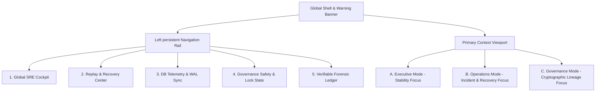
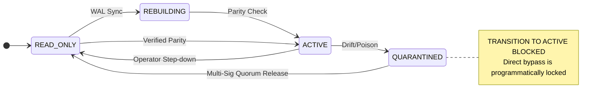

# 🏛️ Nexus ZTAN: UI/UX Governance Console Blueprint
## Operational SRE Cockpit for Long-Term Stewardship (Milestone 36 / LTS.1)

> [!IMPORTANT]
> **Active Architecture Freeze Alignment**
> This blueprint defines the standard user interface and human-system boundaries for the **Nexus ZTAN Enterprise Command Platform**. It enforces a strict **Operational Stewardship philosophy** and a **Bounded SRE Model**—prioritizing absolute operational legibility, failure class visibility, and high-friction safety fences over speculative complexity.

---

## 🏛️ 1. Scope & Design Philosophy: Bounded SRE & Calm UX

Modern SRE teams operate under intense cognitive load during system recovery. The Nexus ZTAN Console is built upon the **"Calm Operational UX"** and **"Kinetic Observatory"** philosophies. The interface does not aim to entertain or speculatively represent "sovereignty"; it acts as a silent, high-fidelity lens over a single, authoritative database coordination oracle (PostgreSQL).

### Core Design Tenets
1. **Cognitive Compression**: Summarize complex state-machines into immediate statuses. Disclose diagnostic evidence only as requested.
2. **High-Friction Recovery**: Destructive recovery ceremonies must require deliberate, multi-step physical validation. 
3. **Existential Parity**: All visible telemetry, lineages, and audit hashes must map directly to raw PostgreSQL transaction blocks and NIST P-256 asymmetric signature verifications.
4. **Boring Operational Excellence**: Success is measured by long-duration quiet operation (high MTBF), near-zero alert fatigue, and low-toil maintenance.

### 🚫 The "Forbidden" Shield (Anti-Patterns Prohibited)
To maintain architectural discipline, the following elements are strictly forbidden in any console views:
* **No Blockchain Theater**: Absolutely no spinning 3D network node meshes, glowing digital ledgers, or speculative transaction animations.
* **No AI Orchestration Dashboards**: No generative AI chatbot interfaces, "agentic planning" status feeds, or non-deterministic conversational dialogues.
* **No Raw Console Floods**: No scrolling screens of raw, unfiltered stdout stream text. All raw traces must be truncated, structured, and parsed.
* **No Speculative UX**: No buttons or widgets for hypothetical future consensus models. If a feature is not frozen in the v1.6.0 core codebase, it cannot appear in the UI.

---

## 📐 2. Information Architecture & Navigation

The console's information architecture is structured around a horizontal master shell containing a left-hand persistent navigation rail and a broad central content viewport.



### Persistent Shell Layout
* **Global Warning Banner (Top)**: Animates only if the frontend degrades into **READ-ONLY LOCAL CACHE MODE**:
  > ⚠️ **AUTHORITATIVE BACKEND UNREACHABLE** — Telemetry freshness degraded. Connection to the authoritative backend ZTAN ledger has eroded.
* **Header Bar**: Displays the cluster's active Epoch (e.g., `EPOCH-036`) and active tenant partition count.
* **Operator Persona Toggle**: A segmented button allows switching view perspectives:
  1. `Executive` — Stability trends, MTTR, and SLA tracking.
  2. `Operations` — Incident response, database telemetry, and manual ceremony wizards.
  3. `Governance` — Lineage tracing, cryptographic proofs, and policy validation.

---

## 📊 3. Master Dashboard Layouts

### 3.1 Operations Dashboard (SRE Cockpit)
Designed for immediate scannability ($\le 10$ seconds scan rule). Uses neutral slate tones with high-energy state-based highlights.

```
+----------------------------------------------------------------------------------------+
|  NEXUS ZTAN // COMMAND COCKPIT                                 [ EPOCH-036 ] ( SRE )   |
+----------------------------------------------------------------------------------------+
| ⚠️ AUTHORITATIVE BACKEND UNREACHABLE - Telemetry freshness degraded. READ-ONLY mode.  |
+----------------------------------------------------------------------------------------+
|                                                                                        |
|  +-----------------------+  +-----------------------+  +-----------------------+       |
|  | POSTGRESQL AUTHORITY  |  | WAL REPLAY PROGRESS   |  | OUTBOX QUEUE DEPTH    |       |
|  |   [ HEALTHY ]         |  |   [ HEALTHY ]         |  |   [ HEALTHY ]         |       |
|  |   Leader Confirmed    |  |   0.8s Replica Lag    |  |   0 Backlogged Items  |       |
|  +-----------------------+  +-----------------------+  +-----------------------+       |
|                                                                                        |
|  +----------------------------------------------------------------------------------+  |
|  | ACTIVE TENANT PARTITION MATRIX                                                   |  |
|  |  +-----------------+  +-----------------+  +-----------------+  +-------------+  |  |
|  |  | PRT-001 [OK]    |  | PRT-002 [OK]    |  | PRT-003 [QUAR]  |  | PRT-004...  |  |  |
|  |  +-----------------+  +-----------------+  +-----------------+  +-------------+  |  |
|  +----------------------------------------------------------------------------------+  |
|                                                                                        |
|  +---------------------------------------+  +---------------------------------------+  |
|  | OPERATIONAL INCIDENTS (LAST 24H)      |  | SYSTEM HEALTH ACTIONS                 |  |
|  |  - [10:14:02] WAL Poison Intercepted  |  |  [ Trigger Replay Poisoning Drill ]   |  |
|  |  - [09:12:11] Outbox Retry Converged  |  |  [ Force Autovacuum Checklist ]       |  |
|  |  - [04:30:22] Epoch Rollover Checked  |  |  [ Initiate NIST Key Ceremony ]       |  |
|  +---------------------------------------+  +---------------------------------------+  |
+----------------------------------------------------------------------------------------+
```

### 3.2 "Explain This" Context Panel
To avoid cognitive fatigue under panic conditions, every telemetry widget or alert card contains a persistent **"Explain This"** action trigger. Clicking it opens a side-drawer that translates technical or cryptographic states into human SRE actions.

* **Example (Drift Alert)**:
  > **Diagnostic Reading**: `Partition PRT-003 status transitioned to QUARANTINED due to hash chain mismatch at sequence ID 1892.`
  > 
  > **Human Translation**: An adversarial replay attempt or file corruption occurred. The console has locked all write capabilities on this specific tenant partition. All other partitions remain operational. You must perform an HSM-authorized Override Ceremony to verify the ledger state against the PostgreSQL master WAL and reset the quarantine.

---

## 🛢️ 4. PostgreSQL-Centered Telemetry Panels

ZTAN's operational guarantees are anchored directly to physical PostgreSQL storage behavior. Visualizing pure database health is paramount to resolving coordinate deadlocks.

### 4.1 WAL & Ledger Sequence Alignment Viewer
A horizontally aligned tracking bar displaying the physical transaction synchronization states.

```
       [ PostgreSQL WAL Commit Index: 1045920 ]
                        |
                        v
|======== ACTIVE SUFFIX REPLAY CHAIN (ABOVE COMPACTION ANCHOR: 1045000) ========|
+-------------------+-------------------+-------------------+-------------------+
| Tx-001 (1045100)  | Tx-002 (1045200)  | Tx-003 (1045300)  | Tx-004 (1045400)  |
| Hash: 0x9f8e...   | Hash: 0x8a1b...   | Hash: 0x7c4d...   | Hash: 0x3b2a...   |
| Verdict: VERIFIED | Verdict: VERIFIED | Verdict: VERIFIED | Verdict: VERIFIED |
+-------------------+-------------------+-------------------+-------------------+
                        &circ;
                        |
            [ Local Validator Head: 1045400 ]
```

### 4.2 Essential Database Health Matrices
Instead of raw charts, we use a three-column SRE health panel focusing strictly on performance constraints:

| Metric Group | SRE Alert Threshold | Visual Indicator Style |
| :--- | :--- | :--- |
| **Autovacuum Pressure** | Tx count since last vacuum > 50,000 | Muted amber warning chip. Displays absolute transaction freeze progress. |
| **Replica Replication Lag** | Lag > 50MB or Time > 1.2s | Double-lined progress bar with current WAL lag size displayed in monospace. |
| **Outbox Queue Saturation** | Unacknowledged outbox items > 10 | Real-time queue count. Triggers dynamic outbox retry indicators. |

---

## 🛡️ 5. Governance UX & State-Machine Enforcement

The console serves as a strict visual proof of the system's finite state boundaries as defined in `INVARIANT_GOVERNANCE_CHARTER.md`.



### 5.1 Permitted Transitions & Active Locks Panel
* **Canonical States (Exactly 4)**: `READ_ONLY`, `REBUILDING`, `ACTIVE`, `QUARANTINED`.
* **State Machine Visualizer**: Displays the state map above. The current state glows with the corresponding status color (e.g., Electric Cyan for `READ_ONLY`, Lithium Green for `ACTIVE`, Crimson for `QUARANTINED`).
* **Visual Lock Enforcement**: If a partition enters `QUARANTINED`, a prominent, glowing physical **Padlock Icon** connects the `QUARANTINED` state to the `ACTIVE` state. Hovering over this locked path displays:
  > **Invariant Lock Active**: Direct quarantine bypass is strictly blocked at the runtime logic layer. You must route through `READ_ONLY` by completing a validated operator multi-signature quorum release ceremony.

---

## 🚨 6. Replay & Recovery Ceremony Console

When the coordination platform locks under "Cognitive Saturation" or a partition enters quarantine, the recovery workflow is guided step-by-step using high-friction UI checkpoints.

### 6.1 Multi-Signature HSM Ceremony Wizard
An interactive modal that guides SREs through manual cryptographic authorization.

```
+----------------------------------------------------------------------------+
| 🔐 CONFLICT MITIGATION // OPERATOR CEREMONY WIZARD                      [X] |
+----------------------------------------------------------------------------+
| STEP 2 OF 3: CRYPTOGRAPHIC SIGNATURE VERIFICATION                          |
|                                                                            |
| Active Quarantine Trigger: [ IFD-001 ] Replay Poisoning Simulation         |
| Epoch Challenge: 0x8a9b2c3d4e5f6789...                                     |
|                                                                            |
| Input Operator P-256 Public Key (Base64 SPKI):                            |
| [ MFkwEwYHKoZIzj0CAQYIKoZIzj0DAQcDQgAE9Xf...                           ] |
|                                                                            |
| Input Operator Ceremony Signature (Base64 DER):                            |
| [ MEUCIQDg4fN+fM8c9X9...                                               ] |
|                                                                            |
| +------------------------------------------------------------------------+ |
| | ⚠️ AUDITABLE ACTION NOTICE                                              | |
| | Completing this ceremony will commit an immutable record to the         | |
| | governance ledger linked to Operator ID: SRE-PRIMARY-01.               | |
| +------------------------------------------------------------------------+ |
|                                                                            |
| [ Cancel Ceremony ]                      [ Validate & Commit Override -> ] |
+----------------------------------------------------------------------------+
```

### 6.2 Blast Radius Estimator
Before executing any rollback or state reconstruction from WAL, the SRE operator is presented with a **Blast Radius Matrix**.

* **Visual Blast Radius Grid**: Displays the exact scope of mutation:
  * **Impacted Tenant Partitions**: Highlighted in Amber.
  * **Archived Records**: Marked as read-only.
  * **Active Outbox Transactions to be Sequentially Replayed**: Listed in a compact table showing sequence ID, original timestamp, and payload size.
* **Friction Lock Button**: The final execution button requires holding the mouse button down for a continuous 3 seconds (or typing the word `VERIFY_RECOVERY_OVERRIDE` in a prompt) to prevent accidental double-clicks.

---

## 📜 7. Immutable Forensic Audit Log Design

The forensic evidence ledger view allows external auditors and SRE teams to trace historical operational truth. It displays the chain generated by `packages/utils/src/governance-ledger.ts`.

### 7.1 Ledger Flow View & Sequence Chaining Indicators
Each log entry is represented as a vertical timeline card. The connection between cards visually indicates the cryptographic pointer status.

```
       +---------------------------------------------+
(003)  | SEQUENCE ID: 3               [ VERIFIED ]   |
       | Type: DRILL_RESOLUTION                      |
       | Payload: IFD-001 overridden via ceremony    |
       | Signature: P-256 Validated                  |
       +---------------------------------------------+
                              |
                     [ Cryptographic Link ]
                     SHA-256 Chain Unbroken
                              |
                              v
       +---------------------------------------------+
(002)  | SEQUENCE ID: 2               [ UNTRUSTED ]  |
       | Type: DRILL_TRIGGER                         |
       | Payload: Poisoned WAL block sequence injected|
       | Signature: Operator Signature Absent        |
       +---------------------------------------------+
```

### 7.2 Forensic Log Field Details

* **Hash Badges**: Displays the SHA-256 `hash` and `prevHash` in a copyable monospace chip. Clicking the chip automatically copies the full 64-character hex string.
* **Audit Verdict Badges**:
  * `VERIFIED` (Green) — Link integrity validated, signatures match active keys, previous hash matches preceding block.
  * `DEGRADED` (Amber) — Transition occurred without asymmetric signature (server-side backup ceremony signing applied).
  * `UNTRUSTED` (Crimson) — Link broken, hash chain mismatch, or signature challenge failed.

---

## 🔐 8. RBAC, Isolation, & Identity Workflows

To prevent unauthorized command execution, actions in the recovery console are constrained by identity fencing.

### 8.1 Operator Identity-Bound Logs
Every state-changing API request maps the operator's private key credential directly to the generated ledger payload. The UI enforces a hybrid hardware boundary:
* **Routine Operations**: Software P-256 keys (e.g., session signing, local telemetry access).
* **High-Risk Operations**: Mandatory hardware-backed **WebAuthn/FIDO2** keys. Operations like Quarantine Release and Override Ceremonies require a physical touch confirmation.

### 8.2 Role Boundary Fencing
The interface actively filters available actions based on operator authorization levels:

| User Role | Dashboard Access | Recovery Operations | Ceremony Participation |
| :--- | :--- | :--- | :--- |
| **SRE Operator (Primary)** | Full Cockpit & Telemetry | Allowed to trigger drills, rollback pipelines, and initiate recovery. | FIDO2/WebAuthn quorum authorization for overrides. |
| **Security Auditor** | Ledger & Compliance Views Only | Read-only. Command actions are hidden or disabled. | Read-only verification of historic DER public keys. |
| **Executive Observer** | Stability Overview Only | Disabled. Single dashboard overview widget active. | Excluded. |

---

## 🎨 9. Design System Guidance (Stitch Compatible)

The console styles align strictly with the **Stitch Design System** specs defined in `projects/3769164171912236337` and `projects/6946124044966063464` ("Kinetic Observatory").

### 9.1 Color Tokens & Visual Density
* **Theme**: Hybrid slate/obsidian palette representing high-density editorial precision.
* **Base Background**: `Slate-950` (#090a0f) — Infinite void.
* **Component Surface**: `Slate-900` (#0f111a) — Standard card/modal background.
* **Friction Surface**: `Slate-800` (#1c1e29) — Recessed panels.
* **Interactive Accents**:
  * **Primary Action**: `Indigo-600` (#4f46e5) / `Neon Green` (#39ff14) for highlights.
  * **Healthy (Status)**: `Emerald-600` (#059669)
  * **Warning (Status)**: `Orange-600` (#ea580c)
  * **Critical/Quarantine (Status)**: `Rose-600` (#e11d48)

### 9.2 Typography Hierarchy
* **Primary Structural Text**: `Inter` or `Geist` — clean, tracking-tight.
* **Data Metrics, Hashes, and Node IDs**: `JetBrains Mono` or `Space Grotesk` — communicates technical authority and accuracy.
* **Typography Scaling**:
  * `headline-lg`: 24px, weight 600, line-height 32px
  * `headline-md`: 20px, weight 500, line-height 28px
  * `body-base`: 14px, weight 400, line-height 20px
  * `code-base`: 13px, weight 400, line-height 18px

### 9.3 Depth, Elevation, & The "No-Line" Rule
* **No 1px solid structural border lines**: Containment must be suggested via background shifts (`Slate-900` cards floating on `Slate-950` background).
* **Ghost Borders**: If visual isolation is required for accessibility, utilize the `outline-variant` token at **15% opacity** (`Slate-700` at 15% opacity).
* **Ambient Glow**: Interactive knobs, sliders, or active alerts achieve lift through a **4%–8% opacity ambient light emission** of the accent color (e.g., soft neon green glow behind the active transition indicators) rather than heavy drop shadows.

---

## 💻 10. Recommended Technology Stack & Performance

To guarantee zero complexity drift, the system operates on a lightweight, modern web stack.

### 10.1 Frontend / Backend Architecture
```
+-----------------------------------------------------------------+
|                       stewardship-console                       |
|           [ Angular 17+ Core Framework ]  [ Vanilla CSS ]       |
+-----------------------------------------------------------------+
                                |
                     [ REST Web APIs / HTTPS ]
                                v
+-----------------------------------------------------------------+
|                            core-api                             |
|          [ Express.js / REST API ]  [ governance-ledger.ts ]    |
+-----------------------------------------------------------------+
                                |
                        [ Prisma ORM ]
                                v
+-----------------------------------------------------------------+
|                       Authoritative DB                          |
|               [ PostgreSQL Transaction Ledger ]                 |
+-----------------------------------------------------------------+
```

### 10.2 Technical Specifications
* **Frontend Framework**: Angular with strict typing. Handles state mapping from flat database records into nested `EvidenceEntry` models.
* **Backend Database Integration**: Prisma ORM targeting PostgreSQL. Schema utilizes physical partitioning with composite primary key `(partitionId, deduplicationId)` to guarantee physical isolation.
* **Styling Layer**: Pure vanilla CSS utilizing custom HSL design system tokens. Avoids external utility frameworks to maintain total long-term maintenance independence.
* **Performance SLOs**:
  * **Dashboard Scan Render Time**: $\le 100\text{ms}$ at 60fps.
  * **Real-time Telemetry Transport**: HTTP polling (2.0s default interval + adaptive exponential backoff). SSE (Server-Sent Events) is optionally reserved only for urgent incident escalation and quarantine banners. Full-duplex WebSockets are strictly prohibited.
  * **Offline Transition Time**: Unreachable REST API falls back to read-only local cache mode in $\le 500\text{ms}$, immediately animating the Global Warning Banner.

---

## 🛑 11. Absolute Operational UI Constraints (The "Freeze" Directives)

To prevent operational entropy, UI degradation, and procedural drift over the lifecycle of the system, the following constraints are constitutionally frozen.

### 11.1 Freeze "Read-Only Means Read-Only"
When the console enters `READ-ONLY LOCAL CACHE MODE` due to backend partition or degraded authority:
* All mutation endpoints are hard-disabled.
* Recovery ceremonies cannot be initiated, and quorum signatures cannot be submitted.
* Rollback execution controls are removed entirely.
* Cached telemetry must be visually timestamped as stale.
* All operator actions become purely observational until authoritative parity is restored.

### 11.2 Freeze Time Semantics
Sequence IDs and PostgreSQL WAL ordering govern all operational truth. Human-readable timestamps are informational only and never determine recovery ordering or conflict resolution.
* **Canonical Time Source**: PostgreSQL transaction timestamp.
* **Browser Local Time**: Display-only.
* **Audit Ordering**: WAL sequence only.
* **Timezone**: UTC-only.
* **Relative Age**: Derived client-side.

### 11.3 Freeze "No Optimistic UI"
All state transitions displayed in the UI must originate **exclusively** from authoritative backend confirmation responses. The console must **never** render speculative or optimistic state transitions, fake success animations, or temporary frontend success states prior to PostgreSQL transaction confirmation.

### 11.4 Freeze Alert Cardinality Limits
To prevent dashboard sprawl and unbounded observability, UI boundaries are strictly capped:
* **Top-Level Dashboard Alerts**: Max 7
* **Simultaneous Warning Banners**: Max 1
* **Incident Feed Visible Rows**: Max 25
* **Concurrent Color States**: Max 4
* **Dashboard Pages**: Fixed/frozen (no dynamic composition)
* **Nested Drill-Down Depth**: $\le 3$

### 11.5 Freeze Browser Resource Budgets
The frontend runtime must remain lightweight to guarantee reliability under incident stress:
* **JS Bundle Size**: $\le 500\text{KB}$ (gzip initial)
* **Concurrent Polling Requests**: $\le 5$
* **Idle CPU Usage**: $\le 3\%$
* **Memory Footprint**: $\le 150\text{MB}$ per browser tab
* **Virtualized Tables**: Mandatory for any list $>500$ rows.

### 11.6 Freeze Accessibility Under Incident Conditions
During incidents, cognitive overload and physical stress require strict accessibility:
* All status colors require explicit text labels. Quarantine state cannot rely on color alone.
* All destructive actions require explicit textual confirmation.
* Full keyboard navigation is mandatory.
* Reduced-motion modes must be supported.
* **Zero** flashing animations and **Zero** auto-playing sound alerts.

### 11.7 Freeze Audit Export Determinism
Forensic audit exports must be reproducible and cross-environment verifiable. All audit exports must be:
* Immutable and append-only.
* UTF-8 normalized.
* Canonicalized JSON.
* Sequence-ordered.
* Reproducibly hashable across environments.

### 11.8 Freeze Mobile Support Policy
Mobile interfaces are inherently dangerous for high-friction recovery ceremonies. Support is strictly gated by form-factor:
* **Desktop**: Full access (Read + Authorized Mutation).
* **Tablet**: Observational only (Read-only).
* **Mobile Phone**: Unsupported.

### 11.9 Freeze "No Plugin System"
The console does not support runtime plugin loading, third-party widget injection, or operator-defined executable dashboard extensions. Observability extensions are prohibited to prevent console rot.

### 11.10 Freeze Human Authority Over Automation
Automated remediation may recommend actions, surface telemetry, or prepare recovery plans, but **all destructive state transitions require explicit human operator authorization and authoritative backend confirmation.**

---

## 📑 12. Reference Matrix & Truth Hierarchy

1. **Running Code & Formal Models**: TypeScript core transition modules and TLA+ specs (`invariants.tla`) govern absolute runtime truth.
2. **This Document (`docs/governance/UI_UX_GOVERNANCE_CONSOLE_BLUEPRINT.md`)**: Governs all user interface layout, typography, navigation, and forbidden anti-patterns.
3. **Stewardship Verification Logs**: Baseline benchmarks and drift records (`packages/production-validation/STEWARDSHIP_ENGINEERING_REPORT.md`).
