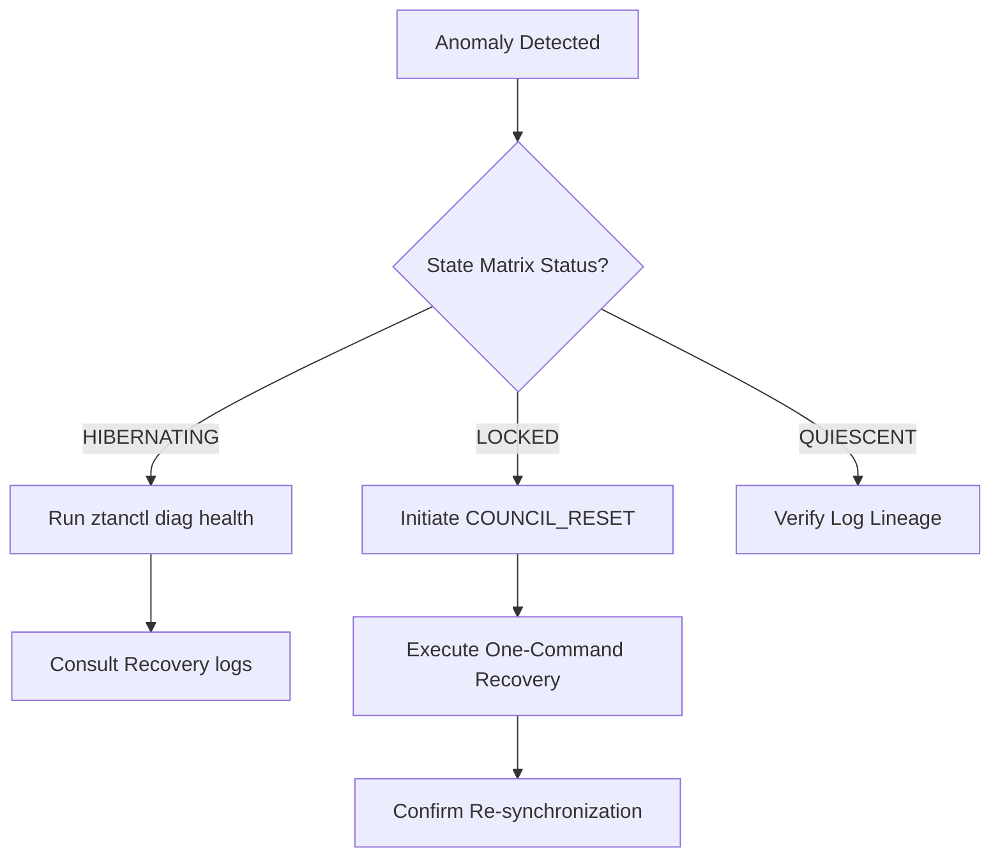

# ZTAN Pilot Deployment Guidelines

This document outlines the operational guidelines, security constraints, and risk management protocols for conducting early enterprise pilot deployments of the **Nexus ZTAN MultiAgent SRE Control Plane**.

## 1. Executive Summary & Blast Radius Control

The primary objective of the pilot phase is to gain operational confidence under low blast-radius conditions. 

> [!WARNING]
> Under no circumstances should a pilot deployment be granted direct, un-fenced modification rights to the primary production infrastructure of the hosting enterprise.

### Blast Radius Constraints
- **Namespace Isolation**: ZTAN agents must be restricted to dedicated Kubernetes namespaces or separate cloud projects.
- **ReadOnly Default**: Initiate deployments with the control plane in `Audit/Advisory` mode before enabling automated execution.
- **Witness Thresholds**: Require a minimum of 3 independent witness notary signatures for any cross-boundary state change.

---

## 2. Pilot Risk Matrix & Mitigation Policies

| Risk Scenario | Probability | Impact | Mitigation Control |
|---|---|---|---|
| **Stochastic Loop Escape** | Low | High | Deterministic OPA policy pre-checks block any action not explicitly signed off by the policy engine. |
| **State Partition Split-Brain** | Low | High | Row-level epoch fencing prevents writes from split-brain nodes. System fails-closed. |
| **Telemetry Cardinality Bloat** | Medium | Low | Active cardinality gates on metrics prevent memory exhausting leaks. |
| **Hypervisor Escape** | Very Low | Critical | Sandboxed container execution within Firecracker microVMs with seccomp-bpf filters. |

---

## 3. Incident Escalation & Response Protocol

When a ZTAN deployment enters a degraded or locked state, the local SRE team must follow this triage workflow:



### Escalation Contacts
- **Primary SRE Lead**: `sre-alerts@ztan.io` (PagerDuty: `ZTAN-SRE-PRIMARY`)
- **Security Incident Response Team**: `security@ztan.io` (PGP Key ID: `0xZTAN-SIRT`)

---

## 4. Operational Runbook & Disaster Recovery

In the event of an unrecoverable database drift or data-center outage:

1. **Verify Ledger Authenticity**:
   Verify the Merkle inclusion receipt with the Rekor transparency log:
   ```bash
   npx tsx packages/ztanctl/src/index.ts --role auditor diag lineage <last-known-task-id>
   ```

2. **Trigger One-Command Recovery**:
   Restore coordinate databases from the last validated state-checkpoint and commit:
   ```bash
   npx tsx packages/ztanctl/src/index.ts --role sre recovery execute
   ```

3. **Validate Restored Invariants**:
   Ensure state is strictly canonical and contains no un-notarized transactions:
   ```bash
   npx tsx scripts/verify-state-transitions.ts
   ```
