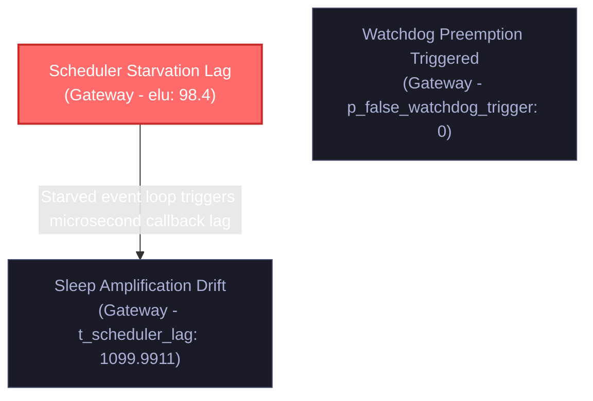

# ZTAN Failure Provenance & Causal Archaeology Report

This report outlines the Directed Acyclic Graph (DAG) causal failure sequence reconstructed by the ZTAN Causal Archaeology Engine.

## 🏁 Root Cause Analysis

> [!CAUTION]
> **Topological Root Cause:** **Scheduler Starvation Lag** in service **Gateway**
> - **Impact Metric:** `elu` observed at `98.4` (Threshold: `90`)
> - **Causal Role:** This node represents the chronological and topological root from which the degradation cascade amplified.

## 📊 Causal Trajectory Flowchart (Mermaid.js)

## 🏗️ Reconstructed Sequence Nodes

| Event ID | Event Name | Service | Metric | Observed Value | Threshold | Relative Delay |
| :--- | :--- | :--- | :--- | :--- | :--- | :--- |
| `evt-temp-01` | **Scheduler Starvation Lag** | `Gateway` | `elu` | `98.4` | `90` | +0 ms |
| `evt-temp-02` | **Sleep Amplification Drift** | `Gateway` | `t_scheduler_lag` | `1099.9911` | `200` | +200 ms |
| `evt-temp-03` | **Watchdog Preemption Triggered** | `Gateway` | `p_false_watchdog_trigger` | `0` | `0` | +400 ms |
