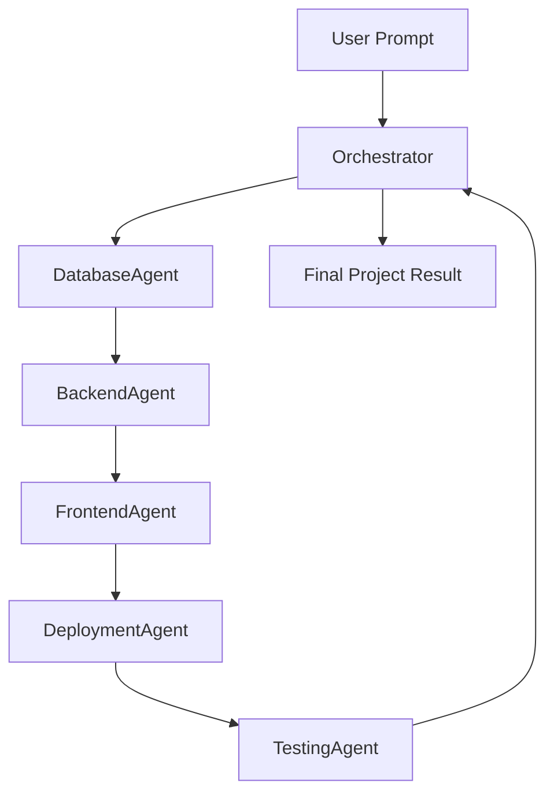

# Multi-Agent Architecture

This directory contains the core intelligence of MultiAgent, refactored into a modular, physical multi-agent system.

## Agent Suite

- **[BaseAgent](./base-agent.ts)**: Abstract base class providing common LLM integration, logging, and structured output handling.
- **[DatabaseAgent](./database-agent.ts)**: Architect specializing in SQL schema design and entity modeling.
- **[BackendAgent](./backend-agent.ts)**: Engineer specializing in API routes and server-side logic generation.
- **[FrontendAgent](./frontend-agent.ts)**: UI Specialist specializing in responsive, premium Tailwind/React component generation.
- **[DeploymentAgent](./deployment-agent.ts)**: DevOps specialist specializing in Docker and hosting configuration.
- **[TestingAgent](./testing-agent.ts)**: QA specialist specializing in unit and integration test generation.

## Coordination Flow

The system uses a **Central Orchestrator** to manage the execution lifecycle.

## Features

1. **Modular**: Each agent can be used independently or as part of the pipeline.
2. **Structured**: Agents return well-defined JSON objects.
3. **Observable**: Every agent maintains internal logs accessible via the Orchestrator.
4. **Resilient**: The Orchestrator manages error propagation and state passing between agents.
